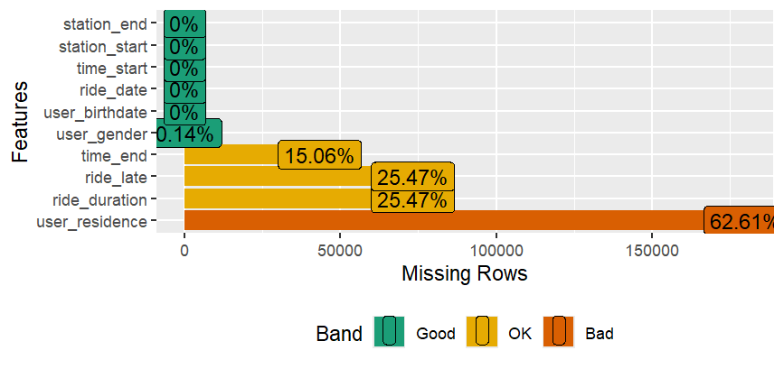

# Estrutura de Dados e Diagnóstico Inicial

> **Etapa:** Data Profiling & Schema Definition  
> **Ferramentas:** R, Tidyverse (dplyr, lubridate), Skimr

---

## 1. Visão Geral da Estrutura
Nesta etapa, é realizada a inspeção técnica dos dados brutos importados para o ambiente R. O objetivo é mapear a estrutura original, definir a tipagem correta para análise e identificar inconsistências que exijam tratamento na fase de limpeza.

Como visto, o *dataset* é composto por dois dataframes principais:
1.  **`df_rides` (Tabela Fato):** Registros transacionais de cada viagem.
2.  **`df_stations` (Tabela Dimensão):** Cadastro e geolocalização das estações.

---

## 2. Dicionário de Dados e Tipagem

### A. Dataframe: `df_rides`
Contém o histórico de utilizações. A inspeção inicial revelou a necessidade de conversão de tipos (casting) e criação de variáveis temporais compostas.

| Variável | Tipo Original | Tipo Alvo | Justificativa Técnica e Ação |
| :--- | :--- | :--- | :--- |
| `user_gender` | `<chr>` | **`<fct>`** | Variável categórica nominal. Conversão para `factor` otimiza armazenamento e plotagem. |
| `user_birthdate` | `<chr>` | **`<date>`** | Necessário converter para cálculo de idade e validação de consistência. |
| `user_residence` | `<chr>` | **`<fct>`** | Variável categórica nominal. |
| `ride_date` | `<chr>` | **`<date>`** | Base temporal primária da viagem. |
| `time_start` | `<chr>` | **`<dttm>`** | **Ação:** Concatenar com `ride_date` para criar um timestamp completo (*datetime*). |
| `time_end` | `<chr>` | **`<dttm>`** | **Ação:** Concatenar com `ride_date` para criar um timestamp completo (*datetime*). |
| `station_start` | `<chr>` | **`<fct>`** | Variável categórica (ID da estação de origem). |
| `station_end` | `<chr>` | **`<fct>`** | Variável categórica (ID da estação de destino). |
| `ride_duration` | `<dbl>` | **`<dbl>`** | Variável numérica contínua. Mantém-se inalterada. |
| `ride_late` | `<int>` | **`<lgl>`** | Variável binária (0/1). Conversão para lógico (`TRUE/FALSE`) para clareza semântica. |

#### 🔧 Pipeline de Transformação (R)
```r
df_rides <- df_rides %>%
  mutate(
    # Engenharia de atributos: Criação de Timestamps completos
    datetime_start = ymd_hms(paste(ride_date, time_start)),
    datetime_end   = ymd_hms(paste(ride_date, time_end)),

    # Casting de Datas
    ride_date      = ymd(ride_date),
    user_birthdate = ymd(user_birthdate),

    # Casting de Categóricas e Lógicos
    user_gender    = factor(user_gender),
    user_residence = factor(user_residence),
    station_start  = factor(station_start),
    station_end    = factor(station_end),
    ride_late      = as.logical(ride_late)
  )
```

### B. Dataframe: `df_stations`

Tabela de consulta (Lookup Table) contendo os metadados das estações.

| **Variável** | **Tipo Original** | **Tipo Alvo** | **Justificativa Técnica e Ação** |
| --- | --- | --- | --- |
| `station` | `<chr>` | **`<chr>`** | Chave primária textual. |
| `station_number` | `<int>` | **`<int>`** | ID numérico auxiliar. |
| `station_name` | `<chr>` | **`<chr>`** | Nome descritivo. **Atenção:** Detectado espaço em branco (trailing whitespace). |
| `lat` | `<dbl>` | **`<dbl>`** | Coordenada geográfica (Latitude). |
| `lon` | `<dbl>` | **`<dbl>`** | Coordenada geográfica (Longitude). |

### 🔧 Correção de Strings (R)

```r
`df_stations <- df_stations %>%
  mutate(
    # Trim para garantir a integridade em Joins futuros
    station_name = trimws(station_name)
  )
```

---

## 3. Relatório de Qualidade de Dados (Data Quality)


Avaliar as colunas de ambos os dataframes para identificar:
- Valores ausentes (NAs)
- Inconsistências lógicas (ex: datas impossíveis, durações negativas)
- Outliers ou valores inválidos

```r
# Resumo estrutural dos dados
summary(df_rides)

skim(df_rides)
skim(df_stations)

# Visualização de valores ausentes
plot_missing(df_rides)

```


Ao revisar a qualidade dos dados em ambos os dataframes, identificando valores ausentes (NAs), outliers e inconsistências que possam impactar a análise subsequente apenas na tabela de viagens (`df_rides`).

As funções de diagnóstico (`summary`, `skim`, `plot_missing`) e evidenciaram **4 anomalias críticas** que deverão ser tratadas na etapa de Limpeza de Dados (`04-LIMPEZA_DADOS.md`).

### 🚩 1. Integridade Referencial (Chaves Órfãs)

- **Problema:** Existem registros em `df_rides` referenciando estações (`station_start` ou `station_end`) que não constam no cadastro `df_stations`.
- **Impacto:** Impossibilidade de obter lat/lon para mapeamento de rotas nessas viagens.

### 🚩 2. Validade Temporal (Datas Impossíveis)

- **Problema:** A coluna `user_birthdate` contém anos que indicam erro de cadastro (ex: datas no futuro ou muito antigas).
- **Impacto:** Distorção no cálculo da idade dos usuários.

### 🚩 3. Completude Crítica (Missing Values em Target)

Identificamos um padrão de ausência de dados que compromete a modelagem:

- **Falha de Parsing:** 43.285 registros em `time_end` não são horas válidas.
- **Ausência de Target:** 73.174 viagens (**25,5% do dataset**) não possuem `ride_duration` nem a flag `ride_late`.
- **Hipótese:** Possível falha no sistema de registro no momento da devolução da bicicleta.

### 🚩 4. Completude Demográfica

- **Problema:** A variável `user_residence` possui **178.486 valores ausentes (NAs)**, representando **62%** da base.
- **Impacto:** Limita severamente a análise geográfica de residência dos usuários.

---
