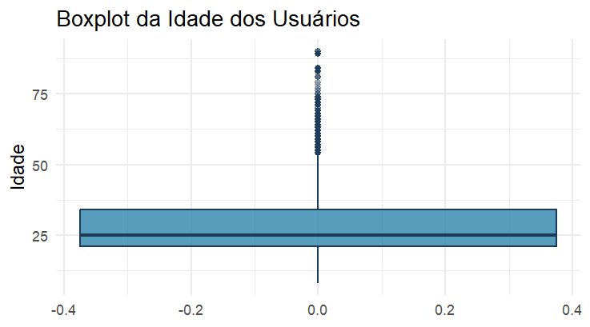
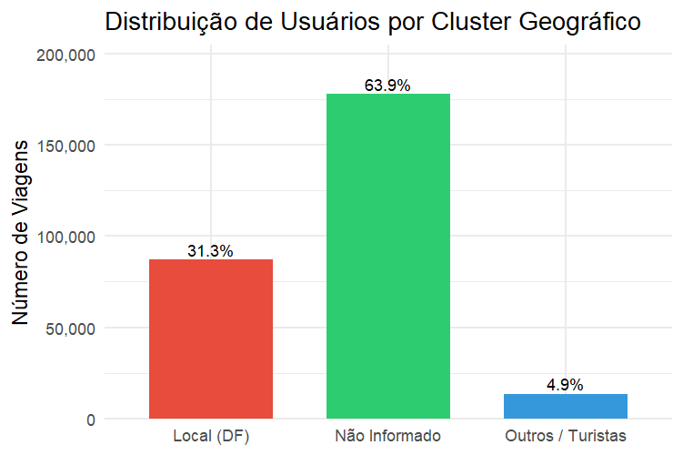

# Análise Exploratória – Sistema +BIKE

A etapa de **Análise Exploratória de Dados (*Exploratory Data Analysis – EDA*)** tem como objetivo investigar, compreender e contextualizar os dados operacionais do sistema +BIKE antes da construção de modelos preditivos.

A EDA é um processo investigativo e indutivo: em vez de impor premissas ao sistema, deixamos que a estrutura interna dos dados revele os reais padrões de comportamento urbano, as anomalias da rede e as forças ocultas que movem o ecossistema +BIKE.

Aqui o interesse é copreender **como o sistema funciona na prática**, e não apenas como ele foi projetado para funcionar. O objetivo é explorar perfil demográfico dos usuários; padrões temporais de uso (hora do dia, dia da semana e sazonalidade); dinâmica de fluxo entre estações (origem–destino); presença de desequilíbrios operacionais na rede; indícios de gargalos físicos ou comportamentais. Essas análises permitirão reconstruir **a lógica real de uso do sistema**.

Outro objetivo é estruturar o problema analítico que será tratado na etapa de modelagem. A exploração não é um fim em si mesma; ela é o laboratório de extração de *features* para a fase de *Machine Learning*. O problema central de negócio a ser resolvido é o esgotamento da frota por uso indevido (viagens acima do limite operacional de 60 minutos). Esse processo permitirá posteriormente estimar:

$$
P(Atraso=1∣X)P(\text{Atraso} = 1 \mid X)
$$

em que $X$ representa estritamente o conjunto de informações observáveis conhecidos pelo sistema antes da bicicleta ser destravada (prevenção de vazamento de dados / *data leakage*).

Para garantir uma narrativa fluida, orientada a dados e imune a vieses cognitivos, a exploração segue quatro dimensões progressivas:

1. Dimensão Univariada: Dissecação isolada de cada variável para compreensão de densidade, assimetria e comportamento de cauda (eventos extremos validados).

2. Dimensão Bivariada (Interações): O cruzamento de dimensões para revelar causalidades ocultas (ex: a taxa de atraso varia significativamente se a viagem começa em um parque aos domingos?).

3. Visualização Estratégica: Aplicação de heurísticas visuais (heatmaps, distribuições e grafos de rede) para sintetizar padrões multidimensionais que passariam despercebidos em matrizes numéricas.

4. Criação de *Features* (*Feature Engineering*): A tradução de hipóteses levantadas visualmente em novas variáveis matemáticas que alimentarão os algoritmos de classificação.

Cada achado desta fase não é tratado como uma mera curiosidade, mas como um bloco fundamental na construção de heurísticas operacionais e modelos de decisão baseados em dados.

------------------------------------------------------------------------

## O quem:

A primeira dimensão da Análise Exploratória busca responder uma pergunta fundamental: Quem é o agente causal que opera o sistema +BIKE?

A demografia não é apenas um retrato sociológico; em um sistema físico com limitações de tempo e desgaste mecânico, a idade, a localização e a familiaridade do usuário com a plataforma ditam a dinâmica de fluxo e o risco de falhas contratuais (os atrasos operacionais acima de 60 minutos).

Para transcender os dados brutos, submetemos as matrizes de data e localidade a uma camada de extração de características, traduzindo informações brutas em variáveis orientadas à hipótese e à modelagem preditiva:

- A Continuidade e a Categoria (Idade): A idade foi calculada de forma exata (`user_age`) para garantir o traçado contínuo das distribuições paramétricas (média, desvio padrão). Simultaneamente, criamos agrupamentos provisórios discretos (`user_age_group_exp`) para facilitar a identificação de blocos comportamentais (ex: 18-24 anos vs. 55-64 anos).

- O Ciclo do Tempo (Horas): Horários foram decompostos em funções trigonométricas contínuas (seno e cosseno, via `hora_inicio_sin`), respeitando a topologia cíclica do tempo em modelos matemáticos — onde as 23:00 estão espacialmente próximas às 01:00.

- A Familiaridade (Geografia): A localidade do usuário deixou de ser uma mera *string* ("BRASILIA (DF)") para tornar-se uma hipótese binária de familiaridade geográfica: o usuário pertence ao ecossistema local (`is_local_df = TRUE`) ou é um ator esporádico (turistas/forasteiros)?

O mapeamento demográfico provou também que o sistema opera sob forte viés de idade economicamente ativa. A base, agora livre de anomalias (nascimentos irreais expurgados da Fase 1), consolidou 278.779 viagens válidas.

### Idades

As idades dos usuários revelou um ecossistema jovem-adulto:

- Média: 28,6 anos.

- Mediana: 25 anos.

- Intervalo Interquartil (IQR): 50% de todas as viagens ocorrem entre os 21 e 34 anos de idade.

> A média (28,6) puxa para a direita em relação à mediana (25). Isso indica a existência de usuários mais velhos que, embora sejam numericamente inferiores (uma "cauda longa" de usuários entre 45 e 65 anos), exercem impacto estrutural na variância geral do sistema. A participação de idosos (\> 65 anos) é sub-representada, o que expõe uma barreira natural de adoção (física ou tecnológica).

A etapa mais valiosa da análise univariada e bivariada é cruzar os atributos descritivos com o nosso alvo de negócio: a infração da regra de 60 minutos (`ride_late`).

Ao confrontar as Faixas Etárias com a Taxa de Atraso Média do Sistema (aprox. 9,9%), descobrimos que o risco operacional não obedece a uma distribuição linear ou homogênea.

> O Risco da Juventude (08–17 anos): Este grupo apresentou a segunda maior taxa relativa de viagens atrasadas. A hipótese central é o comportamento exploratório/lazer. O sistema deixa de ser um modal utilitário (A -\> B) e passa a ser uma plataforma de diversão prolongada, não raras vezes associada a passeios em grupo ou distrações operacionais. O Vale da Produtividade (25-44 anos): O público jovem-adulto apresentou as taxas de atraso sistematicamente abaixo da média geral. Para esse bloco, o sistema é estritamente utilitário (*commuting*). Há previsibilidade temporal e aderência estrita às regras do jogo. O Risco da Idade Avançada (55-64 anos e 65-90 anos): A cauda longa do sistema dispara alarmes de risco. Conforme a idade avança, a duração mediana das viagens sobe acentuadamente, elevando o risco de infração. Aqui, não se presume o uso de lazer exploratório, mas sim uma redução natural da velocidade mecânica de deslocamento, transformando trajetos que seriam curtos para jovens em viagens limítrofes (próximas aos 60 minutos) para idosos.

O usuário médio do +BIKE é um adulto do Distrito Federal, entre 21 e 34 anos, engajado em micromobilidade de alta previsibilidade.

Contudo, para o modelo preditivo, a idade desponta como um moderador não-linear crítico. A propensão ao atraso dispara nas caudas da distribuição etária, confirmando que a idade biológica será um *feature* poderoso para o classificador (Fase 3), separando viagens utilitárias velozes de deslocamentos exploratórios prolongados (jovens) ou fisicamente restritos (idosos).

### Gênero

Aprofundando a dimensão demográfica, investigamos a variável `user_gender`. Na análise de mobilidade urbana, o gênero transcende a mera demografia; ele atua como um *proxy* poderoso para a percepção de segurança da infraestrutura, padrões de deslocamento de cuidado (*mobility of care*) e velocidade média de trânsito físico.

Os dados brutos revelaram uma forte assimetria na adoção do modal: 74% das viagens são realizadas por homens (175.102 registros) contra 26% por mulheres (61.165 registros). Esta predominância massiva sugere a existência de fricções sistêmicas (sejam elas infraestruturais, de segurança viária ou culturais) que limitam o alcance do serviço no público feminino.

No entanto, o cruzamento do gênero com variáveis de rotina revelou uma descoberta contraintuitiva:

- As curvas de densidade de uso ao longo das 24 horas são virtualmente idênticas para ambos os sexos. Não existe uma "barreira de horário" exclusiva para mulheres. Os picos de *commuting* ocorrem exatamente nos mesmos momentos.

- A distribuição estrutural das idades é um espelho entre os gêneros. A diferença reside unicamente no volume de adoção (escala), não na forma da distribuição.

Se a rotina temporal é semelhante, o comportamento mecânico da viagem não é. A análise de duração (isolando viagens \< 60 min para remover ruídos extremos) demonstrou que as mulheres realizam trajetos sistematicamente mais longos.

Em cidades com redes cicloviárias consolidadas e infraestrutura segura, a participação feminina tende a se aproximar da paridade, frequentemente atingindo proporções próximas de **50/50**.

Quando há forte predominância masculina, isso pode refletir:

- maior percepção de risco no trânsito urbano;
- infraestrutura cicloviária insuficiente ou pouco conectada;
- uso predominantemente utilitário do sistema, em vez de recreativo.

No contexto do sistema +BIKE, a análise bivariada revelou ainda que **mulheres tendem a realizar viagens ligeiramente mais longas** e apresentam **taxa média de atraso superior à dos homens**.

Por estas razões, o gênero emerge como uma variável de interesse para a modelagem preditiva, não apenas como um marcador demográfico, mas como um indicador indireto da qualidade da infraestrutura cicloviária e do risco operacional.

O perfil de menor risco para o ecossistema é o homem de 25 a 34 anos. O perfil de maior risco (que exige calibração preditiva urgente) divide-se nos extremos: jovens em viés exploratório e mulheres em faixas etárias mais avançadas.

------------------------------------------------------------------------

## O Onde:

### Geografia

Um dos maiores desafios da análise geográfica foi lidar com a variável **residência do usuário. O que esse vazio significa?**

Na análise de mobilidade urbana, a origem geográfica do usuário dita o seu engajamento com o sistema: ele é um residente inserido em uma rotina previsível ou um visitante em modo exploratório?

Ao investigar a variável de residência, o projeto deparou-se com um desafio clássico de engenharia de dados: 63,9% da base estava ausente, na fase anterior foi rotulada como "NAO INFORMADO".

Sob a ótica dos Primeiros Princípios, a ausência massiva de dados em formulários de cadastro raramente é um ruído estocástico (*Missing Completely at Random* - MCAR). Na maioria das vezes, é um artefato de *User Experience (UX)*: usuários pulando etapas não obrigatórias de um aplicativo para acelerar o primeiro uso. O objetivo da EDA foi interrogar esse vazio, agrupando a base em três *clusters* geográficos e comparando suas assinaturas comportamentais:

1.  Locais (DF)

2.  Não Informado

3.  Outros / Turistas

Para determinar a verdadeira natureza do grupo "Não Informado", os três *clusters* foram submetidos a uma bateria de testes comportamentais que espelham a física e a rotina do sistema.

1.  Ao analisar a distribuição do tempo de viagem, os grupos revelaram suas verdadeiras naturezas logísticas.

    - Locais e "Não Informados": Apresentaram medianas idênticas, travadas em aproximadamente 12 minutos, com baixíssima dispersão. Esta é a assinatura mecânica do uso utilitário e recorrente.

    - Outros / Turistas: Apresentaram viagens estruturalmente mais longas e com caudas pesadas, refletindo um comportamento de lazer, navegação desconhecida ou turismo.

2.  Se o grupo "Não Informado" fosse composto por turistas aleatórios, sua distribuição ao longo do dia seria difusa. Contudo, a curva horária revelou uma sobreposição perfeita com os Locais do DF. Ambos os grupos (Locais e Não Informados) exibem picos bimodais acentuados no início da manhã e no final da tarde — a prova incontestável de deslocamento pendular diário (commuting). O grupo "Outros / Turistas", por sua vez, apresentou uma curva unimodal, com forte concentração à tarde, típica de atividades recreativas.

3.  A taxa de atraso ao longo do dia reforçou a hipótese de que o grupo "Não Informado" é, na verdade, composto por usuários locais. Ambos os grupos (Locais e Não Informados) apresentaram taxas de atraso muito semelhantes (Risco base estabilizado em torno de 8,9%), enquanto o grupo "Outros / Turistas" exibiu taxas significativamente mais altas (Elevação do risco para 12,5%), refletindo viagens mais longas e menos previsíveis.

A evidência empírica é irrefutável: a categoria "NAO INFORMADO" é o espelho estatístico da categoria "Locais (DF)".

O grupo não representa visitantes ocultos, mas sim residentes locais habituais que optaram por fricção zero no momento do cadastro. Se o modelo tratasse esses 63,9% de usuários como dados perdidos, perderíamos a capacidade de mapear a rotina utilitária da cidade.

#### Matriz de Densidade (Faixa Etária × Cluster Geográfico)

| Faixa Etária | Local (DF) | Não Informado | Outros / Turistas |
|--------------|------------|---------------|-------------------|
| 08–17 anos   | Baixa      | Média         | Baixa             |
| 18–24 anos   | Média      | **MÁXIMA CRÍTICA** | Média        |
| 25–34 anos   | Alta       | Alta          | Média             |
| 35–54 anos   | Alta       | Média         | Baixa             |
| 55+ anos     | Média      | Baixa         | Baixa             |

> A matriz de densidade térmica (Heatmap: Idade vs Residência) forneceu a resposta. O grupo "Não Informado" é massivamente composto por jovens entre 18 e 24 anos. Em contrapartida, usuários acima de 35 anos apresentam uma propensão significativamente maior a completar os formulários de registro.A Hipótese de UX: A ausência da residência não é uma falha técnica do banco de dados, mas um comportamento geracional. A fricção do cadastro é rejeitada pelos usuários mais jovens em busca de acesso imediato ao serviço, enquanto usuários mais maduros toleram o processo burocrático de registro.

Em vez de descartar os dados, a modelagem preditiva aplicará uma redução de dimensionalidade inteligente. O ruído cadastral será eliminado fundindo os *clusters* de comportamento idêntico. Utilizar a *feature* binária `is_local_df`, onde "Locais" e "Não Informados" formam a classe majoritária de baixo risco, enquanto "Outros / Turistas" serão isolados como o grupo minoritário de alto risco. Isso preserva 100% da informação relevante do *dataset* e entrega um sinal limpo e forte para os algoritmos de classificação.

------------------------------------------------------------------------

## O Quando:

### Tempo

O tempo não é apenas um eixo passivo em um gráfico; na mobilidade urbana, ele é a força motriz que altera o propósito de uso do sistema. Se a demografia explica o "quem" e a geografia o "onde", a análise temporal responde à pergunta mais urgente para a saúde financeira e logística do +BIKE: Quando o sistema falha mais?

Sob a ótica dos Primeiros Princípios, o atraso de uma bicicleta (`ride_late`) deixou de ser tratado como um evento estocástico (aleatório) e passou a ser analisado como um subproduto previsível do calendário e do relógio.

A divisão da base entre Dias Úteis (`is_weekend = FALSE`) e Finais de Semana (`is_weekend = TRUE`) revelou a mudança de paradigma mais violenta de todo o ecossistema.

- Dia Útil: De segunda a sexta-feira, o sistema opera sob a lógica funcional do *commuting*. A taxa de atraso permanece contida e estável, oscilando entre 6% e 8%. Hipótese: O usuário está ancorado a compromissos fixos (ponto eletrônico, aulas, integrações com outros modais).

- Fim de Semana: Aos sábados e domingos, a taxa de atraso explode para a faixa de 16% a 24% (um risco relativo até três vezes maior). A bicicleta deixa de ser um vetor de trânsito (A $\rightarrow$ B) e torna-se um equipamento de lazer e turismo. 

A interação crítica entre as horas do dia e o tipo de dia provou que o risco do fim de semana é estrutural. Não se trata de um pico isolado à tarde; a curva de risco do fim de semana opera em um patamar superior durante todas as horas do dia, anulando a previsibilidade funcional dos dias úteis.

As interações entre as variáveis temporais e demográficas confirmaram os achados anteriores e, o conjunto destes achados, formaram as hipóteses que guiarão a modelagem preditiva. Por exemplo, ao plotar a taxa de atrasos contra as 24 horas do dia, a EDA mapeou os momentos exatos de falha operacional:

- Os Picos Diurnos (10h e 16h): Confirmando os achados da análise geográfica, o risco sistêmico não ocorre nos horários de maior volume (08h e 17h), mas sim nos vales intermediários (10h e 16h). Viagens iniciadas nestes horários possuem maior probabilidade de infração, configurando as janelas de ouro para a emissão de alertas e notificações preventivas no aplicativo.

- O Abismo da Madrugada (00h às 05h): As horas da madrugada apresentam um volume baixíssimo de viagens, mas concentram chances absolutas e desproporcionais de atraso. O uso noturno profundo correlaciona-se com viagens longas, desorientação espacial, uso recreativo prolongado ou fechamento de frota.

A análise macroscópica dos meses (Janeiro a Agosto) revelou duas narrativas sobrepostas: a expansão do negócio e a sazonalidade do risco.

1. Sazonalidade do Risco (Taxa de Atraso): Embora o volume cresça linearmente, o risco não obedece à mesma regra. Os meses com as maiores taxas de atraso são Janeiro, Abril e Julho. A explicação causal é o calendário civil: são meses fortemente marcados por férias escolares, recesso universitário e feriados prolongados.

2. A Estabilidade Subjacente: Ao cruzar o mês com o tipo de dia (Dia Útil vs. Fim de Semana), confirmamos que o atraso nos dias úteis permanece inabalável (~7%) o ano inteiro. As oscilações mensais de risco são quase inteiramente ditadas pelo aumento do comportamento de "fim de semana/férias" inserido na rotina desses meses específicos.

A evidência é definitiva: o atraso não é ruído estatístico, é um evento condicionado ao tempo. Casos de atraso não são aleatórios, mas sim previsíveis com base em padrões temporais e demográficos. A modelagem preditiva deve, portanto, incorporar inicialmente essas variáveis temporais para melhorar a precisão das previsões e permitir ações preventivas eficazes.

Até este ponto, a análise exploratória mapeou o ecossistema do +BIKE sob as óticas do usuário, do espaço e do calendário. Contudo, a questão mais crítica para o negócio permanecia oculta: o atraso ocorre por comportamento individual (o usuário que decide pedalar mais devagar) ou por limitações estruturais do próprio sistema?  A hipótese inicial ditava que o longo tempo de viagem era uma escolha do locatário. Entretanto, ao investigar a topologia da rede de estações e o fluxo logístico dos deslocamentos, os dados revelaram um mecanismo de falha puramente infraestrutural.

### Dinâmica da Rede

Até este ponto, a análise exploratória mapeou o ecossistema do +BIKE sob as óticas do usuário, do espaço e do calendário. Contudo, a questão mais crítica para o negócio permanecia oculta: o atraso ocorre por comportamento individual (o usuário que decide pedalar mais devagar) ou por limitações estruturais do próprio sistema?  
A hipótese inicial ditava que o longo tempo de viagem era uma escolha do locatário. Entretanto, ao investigar a topologia da rede de estações e o fluxo logístico dos deslocamentos, os dados revelaram um mecanismo de falha puramente infraestrutural.

Ao analisar as métricas das estações, notou-se que pontos específicos da cidade (como "Brasil 21", "Torre de TV" e "SRTVS") figuravam sistematicamente no topo dos *rankings* de atraso. Para entender essa concentração, as viagens dessas "estações críticas" foram divididas em um teste A/B observacional: viagens que começavam nessas estações (Retirada) contra viagens que terminavam nessas estações (Devolução).
O resultado revelou a verdadeira assimetria do problema:

- Retirada (Origem): Quando o usuário inicia a viagem em uma estação crítica, a taxa média de atraso gravita em torno de 8,6% (dentro da normalidade do sistema).

- Devolução (Destino): Quando a mesma estação crítica é o ponto final planejado, a taxa de atraso explode para aproximadamente 23,9%.

> O usuário consegue destrancar a bicicleta e iniciar sua viagem sem atritos.
> O problema logístico e o risco de infração concentram-se esmagadoramente no final da jornada: o atraso nasce na impossibilidade de devolução.

Ou seja, a incapacidade de devolução não é aleatória; ela obedece às leis da física do trânsito urbano. Através da criação da métrica de `saldo_fluxo` (Total de Entradas menos Total de Saídas por estação), a análise comprovou que o sistema sofre de um grave desequilíbrio logístico pendular.

Algumas estações funcionam predominantemente como alimentadoras (emitem bicicletas), enquanto outras atuam como sumidouros (recebem bicicletas). A regressão linear entre o saldo de fluxo e a taxa de atraso apontou uma forte correlação positiva: quanto mais o saldo pendular pende para o acúmulo (entradas superando saídas), maior é o risco sistêmico de atraso naquelas docas.
Este colapso do sistema segue uma cadeia de eventos determinística:

1. Desequilíbrio de Rede: Uma onda de usuários se desloca simultaneamente para destinos comuns.

2. Saturação Física: O volume de bicicletas que chega supera a quantidade de docas físicas disponíveis na estação.

3. Navegação Forçada: Impossibilitado de devolver o equipamento, o usuário é expulso da estação planejada e precisa pedalar em busca de docas livres nas redondezas.

4. A Ruptura do Limiar: O tempo extra e improdutivo "rodando" pela estação alternativa consome os minutos finais de tolerância, rompendo a barreira operacional de 60 minutos e gerando a penalidade.

Diante desta mecânica, a hipótese de que "viagens longas causam atrasos" precisou ser desconstruída. A métrica de duração registrada no banco de dados não representa apenas o tempo de deslocamento útil; ela carrega embutido o tempo de procura por vaga.

Ao isolar o excesso de duração (os minutos gastos além da mediana histórica para a mesma rota e horário), os dados provaram que o atraso surge majoritariamente dessa "gordura" logística final.

> A duração da viagem não causa o atraso; ela registra o efeito do atraso. Ela é o sintoma operacional de uma rede saturada.

Essa descoberta dita uma regra fundamental para a próxima etapa: utilizar a duração final da viagem como variável preditora caracterizaria um severo vazamento de dados (*data leakage*). O modelo estaria trapaceando ao utilizar a própria manifestação do problema para prevê-lo.

A exploração rigorosa dos dados enterra o pressuposto de que as infrações são anomalias aleatórias ou desvios de conduta do usuário.
O atraso no +BIKE é condicionado pelo calendário, moldado pela demografia e engatilhado pela saturação física de docas.

Com a constatação de que a base de dados opera em uma linha de falha estrutural de 9% a 10%, o projeto de *Machine Learning* classifica-se formalmente como um problema de dados desbalanceados.
O uso da acurácia como métrica primária é descartado, pois prever que "ninguém se atrasa" garantiria 90% de acerto sem gerar qualquer valor prático.
O sucesso algorítmico será avaliado por *AUC-ROC*, *Precision* e *Recall*, focando na real identificação do risco.

O objetivo da próxima fase é construir um classificador que estime a probabilidade de falha logística antes da viagem acontecer, com base estritamente no conhecimento disponível no tempo zero ($t_0$):

$$P(\text{Atraso} = 1 \mid X)$$

Nesta equação, $X$ representa as variáveis de contexto temporal, demográfico e geográfico da origem. Antecipar a ruptura logística não serve para punir o usuário, mas sim para fornecer inteligência ao operador da rede, permitindo remanejamento de frota e notificações dinâmicas antes que a saturação ocorra.

Como na etapa anterior a base de dados foi enriquecida com *features* derivadas, a modelagem preditiva terá acesso a um conjunto de variáveis mais robusto e informativo, aumentando a capacidade de previsão do classificador.
