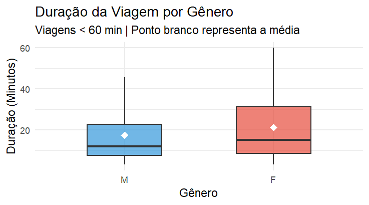

# Análise Exploratória – Sistema +BIKE

A etapa de **Análise Exploratória de Dados (*Exploratory Data Analysis – EDA*)** tem como objetivo investigar, compreender e contextualizar os dados operacionais do sistema +BIKE antes da construção de modelos preditivos.

A EDA é um processo investigativo e indutivo: em vez de impor premissas ao sistema, deixamos que a estrutura interna dos dados revele os reais padrões de comportamento urbano, as anomalias da rede e as forças ocultas que movem o ecossistema +BIKE.

Aqui o interesse é copreender **como o sistema funciona na prática**, e não apenas como ele foi projetado para funcionar. O objetivo é explorar perfil demográfico dos usuários; padrões temporais de uso (hora do dia, dia da semana e sazonalidade); dinâmica de fluxo entre estações (origem–destino); presença de desequilíbrios operacionais na rede; indícios de gargalos físicos ou comportamentais. Essas análises permitirão reconstruir **a lógica real de uso do sistema**.

Outro objetivo é estruturar o problema analítico que será tratado na etapa de modelagem. A exploração não é um fim em si mesma; ela é o laboratório de extração de *features* para a fase de *Machine Learning*. O problema central de negócio a ser resolvido é o esgotamento da frota por uso indevido (viagens acima do limite operacional de 60 minutos). Esse processo permitirá posteriormente estimar:

$$
P(Atraso=1∣X)P(\text{Atraso} = 1 \mid X)
$$

em que $X$ representa estritamente o conjunto de informações observáveis conhecidos pelo sistema antes da bicicleta ser destravada (prevenção de vazamento de dados / *data leakage*).

Para garantir uma narrativa fluida, orientada a dados e imune a vieses cognitivos, a exploração segue quatro dimensões progressivas:

1.  Dimensão Univariada: Dissecação isolada de cada variável para compreensão de densidade, assimetria e comportamento de cauda (eventos extremos validados).

2.  Dimensão Bivariada (Interações): O cruzamento de dimensões para revelar causalidades ocultas (ex: a taxa de atraso varia significativamente se a viagem começa em um parque aos domingos?).

3.  Visualização Estratégica: Aplicação de heurísticas visuais (heatmaps, distribuições e grafos de rede) para sintetizar padrões multidimensionais que passariam despercebidos em matrizes numéricas.

4.  Criação de *Features* (*Feature Engineering*): A tradução de hipóteses levantadas visualmente em novas variáveis matemáticas que alimentarão os algoritmos de classificação.

Cada achado desta fase não é tratado como uma mera curiosidade, mas como um bloco fundamental na construção de heurísticas operacionais e modelos de decisão baseados em dados.

------------------------------------------------------------------------

## O quem

A primeira dimensão da Análise Exploratória busca responder uma pergunta fundamental: Quem é o agente causal que opera o sistema +BIKE?

A demografia não é apenas um retrato sociológico; em um sistema físico com limitações de tempo e desgaste mecânico, a idade, a localização e a familiaridade do usuário com a plataforma ditam a dinâmica de fluxo e o risco de falhas contratuais (os atrasos operacionais acima de 60 minutos).

Para transcender os dados brutos, submetemos as matrizes de data e localidade a uma camada de extração de características, traduzindo informações brutas em variáveis orientadas à hipótese e à modelagem preditiva:

- A Continuidade e a Categoria (Idade): A idade foi calculada de forma exata (`user_age`) para garantir o traçado contínuo das distribuições paramétricas (média, desvio padrão). Simultaneamente, criamos agrupamentos provisórios discretos (`user_age_group_exp`) para facilitar a identificação de blocos comportamentais (ex: 18-24 anos vs. 55-64 anos).

- O Ciclo do Tempo (Horas): Horários foram decompostos em funções trigonométricas contínuas (seno e cosseno, via `hora_inicio_sin`), respeitando a topologia cíclica do tempo em modelos matemáticos — onde as 23:00 estão espacialmente próximas às 01:00.

- A Familiaridade (Geografia): A localidade do usuário deixou de ser uma mera *string* ("BRASILIA (DF)") para tornar-se uma hipótese binária de familiaridade geográfica: o usuário pertence ao ecossistema local (`is_local_df = TRUE`) ou é um ator esporádico (turistas/forasteiros)?

O mapeamento demográfico provou também que o sistema opera sob forte viés de idade economicamente ativa. A base, agora livre de anomalias (nascimentos irreais expurgados da Fase 1), consolidou 278.779 viagens válidas.

### Idades

As idades dos usuários revelou um ecossistema jovem-adulto:



- Média: 28,6 anos.

- Mediana: 25 anos.

- Intervalo Interquartil (IQR): 50% de todas as viagens ocorrem entre os 21 e 34 anos de idade.

> A média (28,6) puxa para a direita em relação à mediana (25). Isso indica a existência de usuários mais velhos que, embora sejam numericamente inferiores (uma "cauda longa" de usuários entre 45 e 65 anos), exercem impacto estrutural na variância geral do sistema. A participação de idosos (\> 65 anos) é sub-representada, o que expõe uma barreira natural de adoção (física ou tecnológica).

A etapa mais valiosa da análise univariada e bivariada é cruzar os atributos descritivos com o nosso alvo de negócio: a infração da regra de 60 minutos (`ride_late`).

Ao confrontar as Faixas Etárias com a Taxa de Atraso Média do Sistema (aprox. 9,9%), descobrimos que o risco operacional não obedece a uma distribuição linear ou homogênea.


> O Risco da Juventude (08–17 anos): Este grupo apresentou a segunda maior taxa relativa de viagens atrasadas. A hipótese central é o comportamento exploratório/lazer. O sistema deixa de ser um modal utilitário (A -\> B) e passa a ser uma plataforma de diversão prolongada, não raras vezes associada a passeios em grupo ou distrações operacionais. O Vale da Produtividade (25-44 anos): O público jovem-adulto apresentou as taxas de atraso sistematicamente abaixo da média geral. Para esse bloco, o sistema é estritamente utilitário (*commuting*). Há previsibilidade temporal e aderência estrita às regras do jogo. O Risco da Idade Avançada (55-64 anos e 65-90 anos): A cauda longa do sistema dispara alarmes de risco. Conforme a idade avança, a duração mediana das viagens sobe acentuadamente, elevando o risco de infração. Aqui, não se presume o uso de lazer exploratório, mas sim uma redução natural da velocidade mecânica de deslocamento, transformando trajetos que seriam curtos para jovens em viagens limítrofes (próximas aos 60 minutos) para idosos.

O usuário médio do +BIKE é um adulto do Distrito Federal, entre 21 e 34 anos, engajado em micromobilidade de alta previsibilidade.

Contudo, para o modelo preditivo, a idade desponta como um moderador não-linear crítico. A propensão ao atraso dispara nas caudas da distribuição etária, confirmando que a idade biológica será um *feature* poderoso para o classificador (Fase 3), separando viagens utilitárias velozes de deslocamentos exploratórios prolongados (jovens) ou fisicamente restritos (idosos).

### Gênero

Aprofundando a dimensão demográfica, investigamos a variável `user_gender`. Na análise de mobilidade urbana, o gênero transcende a mera demografia; ele atua como um *proxy* poderoso para a percepção de segurança da infraestrutura, padrões de deslocamento de cuidado (*mobility of care*) e velocidade média de trânsito físico.

Os dados brutos revelaram uma forte assimetria na adoção do modal: 74% das viagens são realizadas por homens (175.102 registros) contra 26% por mulheres (61.165 registros). Esta predominância massiva sugere a existência de fricções sistêmicas (sejam elas infraestruturais, de segurança viária ou culturais) que limitam o alcance do serviço no público feminino.

No entanto, o cruzamento do gênero com variáveis de rotina revelou uma descoberta contraintuitiva:

- As curvas de densidade de uso ao longo das 24 horas são virtualmente idênticas para ambos os sexos. Não existe uma "barreira de horário" exclusiva para mulheres. Os picos de *commuting* ocorrem exatamente nos mesmos momentos.

- A distribuição estrutural das idades é um espelho entre os gêneros. A diferença reside unicamente no volume de adoção (escala), não na forma da distribuição.

Se a rotina temporal é semelhante, o comportamento mecânico da viagem não é. A análise de duração (isolando viagens \< 60 min para remover ruídos extremos) demonstrou que as mulheres realizam trajetos sistematicamente mais longos.

Em cidades com redes cicloviárias consolidadas e infraestrutura segura, a participação feminina tende a se aproximar da paridade, frequentemente atingindo proporções próximas de **50/50**.

Quando há forte predominância masculina, isso pode refletir:

- maior percepção de risco no trânsito urbano;
- infraestrutura cicloviária insuficiente ou pouco conectada;
- uso predominantemente utilitário do sistema, em vez de recreativo.

No contexto do sistema +BIKE, a análise bivariada revelou ainda que **mulheres tendem a realizar viagens ligeiramente mais longas** e apresentam **taxa média de atraso superior à dos homens**.

Por estas razões, o gênero emerge como uma variável de interesse para a modelagem preditiva, não apenas como um marcador demográfico, mas como um indicador indireto da qualidade da infraestrutura cicloviária e do risco operacional.

O perfil de menor risco para o ecossistema é o homem de 25 a 34 anos. O perfil de maior risco (que exige calibração preditiva urgente) divide-se nos extremos: jovens em viés exploratório e mulheres em faixas etárias mais avançadas.

### Geografia


Um dos maiores desafios da análise geográfica foi lidar com a variável **residência do usuário. O que esse vazio significa?**

Na análise de mobilidade urbana, a origem geográfica do usuário dita o seu engajamento com o sistema: ele é um residente inserido em uma rotina previsível ou um visitante em modo exploratório?

Ao investigar a variável de residência, o projeto deparou-se com um desafio clássico de engenharia de dados: 63,9% da base estava ausente, na fase anterior foi rotulada como "NAO INFORMADO".

Sob a ótica dos Primeiros Princípios, a ausência massiva de dados em formulários de cadastro raramente é um ruído estocástico (*Missing Completely at Random* - MCAR). Na maioria das vezes, é um artefato de *User Experience (UX)*: usuários pulando etapas não obrigatórias de um aplicativo para acelerar o primeiro uso. O objetivo da EDA foi interrogar esse vazio, agrupando a base em três *clusters* geográficos e comparando suas assinaturas comportamentais:

1.  Locais (DF)

2.  Não Informado

3.  Outros / Turistas


Para determinar a verdadeira natureza do grupo "Não Informado", os três *clusters* foram submetidos a uma bateria de testes comportamentais que espelham a física e a rotina do sistema.

1.  Ao analisar a distribuição do tempo de viagem, os grupos revelaram suas verdadeiras naturezas logísticas.

    - Locais e "Não Informados": Apresentaram medianas idênticas, travadas em aproximadamente 12 minutos, com baixíssima dispersão. Esta é a assinatura mecânica do uso utilitário e recorrente.

    - Outros / Turistas: Apresentaram viagens estruturalmente mais longas e com caudas pesadas, refletindo um comportamento de lazer, navegação desconhecida ou turismo.

2.  Se o grupo "Não Informado" fosse composto por turistas aleatórios, sua distribuição ao longo do dia seria difusa. Contudo, a curva horária revelou uma sobreposição perfeita com os Locais do DF. Ambos os grupos (Locais e Não Informados) exibem picos bimodais acentuados no início da manhã e no final da tarde — a prova incontestável de deslocamento pendular diário (commuting). O grupo "Outros / Turistas", por sua vez, apresentou uma curva unimodal, com forte concentração à tarde, típica de atividades recreativas.

3.  A taxa de atraso ao longo do dia reforçou a hipótese de que o grupo "Não Informado" é, na verdade, composto por usuários locais. Ambos os grupos (Locais e Não Informados) apresentaram taxas de atraso muito semelhantes (Risco base estabilizado em torno de 8,9%), enquanto o grupo "Outros / Turistas" exibiu taxas significativamente mais altas (Elevação do risco para 12,5%), refletindo viagens mais longas e menos previsíveis.

A evidência empírica é irrefutável: a categoria "NAO INFORMADO" é o espelho estatístico da categoria "Locais (DF)".

O grupo não representa visitantes ocultos, mas sim residentes locais habituais que optaram por fricção zero no momento do cadastro. Se o modelo tratasse esses 63,9% de usuários como dados perdidos, perderíamos a capacidade de mapear a rotina utilitária da cidade.

================================================================================

MATRIZ DE DENSIDADE (FAIXA ETÁRIA x CLUSTER GEOGRÁFICO) ================================================================================

Faixa Etária \| Local (DF) \| Não Informado \| Outros / Turistas

--------------------------------------------------------------------------------

08–17 anos \| Baixa \| Média \| Baixa\
18–24 anos \| Média \| MÁXIMA CRÍTICA \| Média\
25–34 anos \| Alta \| Alta \| Média\
35–54 anos \| Alta \| Média \| Baixa\
55+ anos \| Média \| Baixa \| Baixa\
================================================================================

> A matriz de densidade térmica (Heatmap: Idade vs Residência) forneceu a resposta. O grupo "Não Informado" é massivamente composto por jovens entre 18 e 24 anos. Em contrapartida, usuários acima de 35 anos apresentam uma propensão significativamente maior a completar os formulários de registro.A Hipótese de UX: A ausência da residência não é uma falha técnica do banco de dados, mas um comportamento geracional. A fricção do cadastro é rejeitada pelos usuários mais jovens em busca de acesso imediato ao serviço, enquanto usuários mais maduros toleram o processo burocrático de registro.

Em vez de descartar os dados, a modelagem preditiva aplicará uma redução de dimensionalidade inteligente. O ruído cadastral será eliminado fundindo os *clusters* de comportamento idêntico. Utilizar a *feature* binária `is_local_df`, onde "Locais" e "Não Informados" formam a classe majoritária de baixo risco, enquanto "Outros / Turistas" serão isolados como o grupo minoritário de alto risco. Isso preserva 100% da informação relevante do *dataset* e entrega um sinal limpo e forte para os algoritmos de classificação.

------------------------------------------------------------------------

# 5️⃣ Padrões Temporais e Sazonalidade

Após analisar o perfil dos usuários e a dimensão geográfica do sistema, a próxima etapa da EDA buscou responder uma pergunta central:

**Quando o sistema +BIKE apresenta maior probabilidade de atraso?**

A análise da dimensão temporal revelou que o comportamento do sistema não é homogêneo ao longo da semana. Na prática, o sistema opera sob **duas lógicas principais de uso**, associadas ao contexto em que as viagens ocorrem.

------------------------------------------------------------------------

## Uso Funcional — Dias Úteis

Durante os **dias úteis**, o sistema apresenta características típicas de uso voltado à mobilidade cotidiana.

Observa-se:

- **maior volume absoluto de viagens**;
- **concentração horária nos períodos de pico**, especialmente início da manhã e final da tarde;
- **taxas de atraso relativamente baixas**, geralmente entre **6% e 8%**.

Esse padrão é consistente com deslocamentos regulares associados a **trabalho, estudo ou integração com outros modos de transporte**.

Nesse contexto, as viagens tendem a ser:

- mais curtas
- mais previsíveis
- realizadas em horários bem definidos

Essas características reduzem a probabilidade de desequilíbrios operacionais na rede.

------------------------------------------------------------------------

## Uso Recreativo — Finais de Semana

Nos **finais de semana**, o comportamento do sistema muda de forma significativa.

A análise mostra:

- **menor volume total de viagens**;
- **maior dispersão horária de uso**;
- **duração média de viagem mais elevada**;
- **aumento expressivo na taxa de atraso**.


Enquanto em dias úteis a taxa de atraso orbita a casa dos 6% a 8% (uso funcional), nos **finais de semana o risco explode para valores entre 16% e 24%** (uso recreativo).


Esse comportamento sugere um padrão de uso predominantemente **recreativo ou turístico**, no qual os usuários permanecem mais tempo com as bicicletas e realizam deslocamentos menos previsíveis.

Como consequência, aumenta a probabilidade de **desequilíbrios temporários na rede de estações**, especialmente em áreas com maior concentração de devoluções.

------------------------------------------------------------------------

A análise temporal demonstra que o atraso no sistema +BIKE **não ocorre de forma aleatória**.

Ele está **fortemente condicionado ao contexto temporal em que a viagem ocorre**, especialmente:

- **dia da semana**
- **hora do dia**
- **tipo de uso predominante (funcional vs recreativo)**

Esses resultados indicam que **variáveis temporais desempenham papel fundamental na explicação do risco de atraso**, sendo, portanto, componentes essenciais para a etapa de **modelagem preditiva**.

------------------------------------------------------------------------

> **🚦 Síntese Temporal:** O atraso não é um ruído estocástico. É um evento previsível, altamente condicionado à janela de tempo (hora/dia) em que a viagem ocorre.

------------------------------------------------------------------------

# 6️⃣ Diagnóstico Causal: Rede, Estações e Gargalos Físicos

# 6️⃣ Dinâmica da Rede e Gargalos Operacionais

Até este ponto da análise, diversos fatores associados ao atraso já haviam sido identificados — perfil do usuário, contexto temporal e padrões geográficos. No entanto, permanecia uma questão central:

**o atraso ocorre por comportamento do usuário ou por limitações estruturais do sistema?**

A hipótese inicial considerava que viagens longas ou comportamentos individuais pudessem explicar grande parte dos atrasos. Entretanto, a análise espacial e de rede revelou um mecanismo diferente.

Os resultados indicam que o atraso está **fortemente associado à dinâmica física das estações**, especialmente ao equilíbrio entre retiradas e devoluções ao longo da rede.

## 

## 

Essa evidência sugere que o atraso não emerge apenas de decisões individuais do usuário, mas sim de restrições operacionais do próprio sistema.

### A Dinâmica do Colapso Operacional

A análise exploratória permitiu identificar um **mecanismo estrutural recorrente**, que pode ser descrito como uma cadeia de eventos operacionais.

## 

1️⃣ **Desequilíbrio de fluxo entre estações**

Algumas estações funcionam predominantemente como **origem**, enquanto outras concentram **devoluções**. Esse desequilíbrio gera acúmulo progressivo de bicicletas em determinados pontos da rede.

------------------------------------------------------------------------

2️⃣ **Saturação das docas de destino**

Quando muitas bicicletas chegam simultaneamente a uma estação com capacidade limitada, as **docas disponíveis se esgotam**.

Nesse momento, o sistema entra em uma condição de saturação local.

## 

3️⃣ **Busca por estação alternativa**

Sem vagas disponíveis na estação planejada, o usuário precisa continuar pedalando até encontrar outra estação com docas livres.

Esse comportamento aumenta artificialmente o tempo total da viagem.

------------------------------------------------------------------------

4️⃣ **Registro do atraso**

Como consequência, o sistema registra um **tempo de viagem superior ao limite operacional**, classificando a corrida como atraso.

------------------------------------------------------------------------

## 

------------------------------------------------------------------------

# 7️⃣ Duração vs. Atraso — Separando Sintoma de Causa

Uma das hipóteses mais importantes investigadas durante a EDA foi a relação entre **duração da viagem** e **ocorrência de atraso**.

A pergunta inicial era direta:

**Viagens mais longas causam atraso no sistema +BIKE?**

Essa hipótese é intuitiva. Se um usuário permanece mais tempo com a bicicleta, seria razoável esperar maior probabilidade de ultrapassar o limite operacional da corrida.

Entretanto, a análise detalhada dos dados revelou uma interpretação diferente.

------------------------------------------------------------------------

### Evidência Empírica

De fato, as estatísticas descritivas mostram que **viagens longas apresentam maior taxa de atraso**. Enquanto viagens curtas quase nunca ultrapassam o limite de tempo, viagens com maior duração apresentam taxas de atraso significativamente mais elevadas.

Esse padrão poderia levar à conclusão de que **a duração explica o atraso**.

Contudo, a análise operacional da rede — realizada na etapa anterior — indica que essa interpretação seria equivocada.

------------------------------------------------------------------------

### Interpretação Operacional

A duração observada da viagem **não representa apenas o tempo de deslocamento do usuário**.

Ela também inclui o **tempo adicional gasto após a chegada ao destino**, quando o usuário não consegue devolver a bicicleta na estação planejada.

Nesse cenário, o usuário precisa continuar pedalando até encontrar outra estação com docas disponíveis, prolongando artificialmente o tempo total da corrida.

Assim, a duração registrada pelo sistema passa a refletir não apenas o deslocamento, mas também **o tempo imposto pela saturação da rede**.

------------------------------------------------------------------------

Essa distinção é fundamental para a interpretação correta do fenômeno.

- **A duração não causa o atraso.**
- **Ela registra o efeito do atraso.**

Em outras palavras, a duração funciona como **um sintoma do problema**, e não como sua causa estrutural.

------------------------------------------------------------------------

A EDA demonstra que o atraso no sistema +BIKE **não decorre primariamente de decisões individuais dos usuários**, como pedalar mais devagar ou prolongar voluntariamente a viagem.

Em vez disso, o fenômeno emerge das **restrições físicas e operacionais da rede de estações**, especialmente da indisponibilidade de docas no momento da devolução.

## 

------------------------------------------------------------------------

# 8️⃣ Linha de Base para Modelagem

Após as etapas de limpeza, validação e exploração dos dados, foi possível estabelecer a **linha de base estatística do problema de atraso no sistema +BIKE**.

A análise da variável `ride_late` indica que aproximadamente **9% a 10% das viagens registradas resultam em atraso**.

Esse valor define o **nível estrutural de ocorrência do evento de interesse** dentro da base analisada.

Do ponto de vista estatístico, isso caracteriza um **problema de classificação desbalanceada**, no qual a classe de interesse (viagens com atraso) representa uma parcela relativamente pequena do total de observações.

Essa característica tem implicações diretas na avaliação de modelos preditivos.

Se fosse utilizada apenas a métrica de **acurácia**, um modelo trivial que previsse sempre *“sem atraso”* alcançaria cerca de **90% de acerto**, apesar de não possuir qualquer utilidade prática para identificar situações de risco.

Por esse motivo, a avaliação do modelo deverá priorizar métricas mais adequadas para cenários desbalanceados, como:

- **AUC-ROC**, para avaliar a capacidade discriminativa do modelo;
- **Precision**, para medir a proporção de previsões corretas entre os casos classificados como atraso;
- **Recall**, para avaliar a capacidade do modelo de identificar viagens que efetivamente resultarão em atraso.

Essas métricas permitem avaliar de forma mais robusta a capacidade do modelo em **detectar eventos raros, mas operacionalmente relevantes**.

------------------------------------------------------------------------

# 9️⃣ Encerramento da EDA e Transição para Modelagem

A Análise Exploratória de Dados permitiu compreender de forma abrangente os padrões de funcionamento do sistema +BIKE e identificar os principais fatores associados à ocorrência de atrasos.

De forma geral, os resultados indicam que o atraso no sistema:

✔ **não é um ruído aleatório** nos dados;

✔ **não decorre predominantemente de comportamento individual do usuário**;

✔ **está fortemente associado ao contexto temporal de uso**, especialmente em finais de semana;

✔ **emerge de desequilíbrios operacionais na rede de estações**, particularmente da saturação de docas durante o processo de devolução.

Essas evidências permitem formalizar o problema de modelagem como a **estimação da probabilidade de atraso antes do início da viagem**.

Matematicamente, o objetivo do modelo pode ser expresso como:

``` latex
P(Atraso=1∣X)P(\text{Atraso} = 1 \mid X)
```

em que $X$ representa o conjunto de variáveis observáveis **no momento da retirada da bicicleta**.

Essa restrição é fundamental para garantir a validade operacional do modelo. Variáveis que representam **informações posteriores ao evento**, como a duração final da viagem, não podem ser utilizadas como preditores, pois constituem sintomas do atraso e não suas causas.

Dessa forma, o modelo deve aprender a identificar **padrões estruturais de risco**, baseando-se apenas em informações disponíveis no início da corrida, como:

- contexto temporal da viagem
- características do usuário
- estação de origem
- condições operacionais da rede

O objetivo da modelagem não é penalizar usuários por viagens longas, mas sim **antecipar contextos de risco operacional**, permitindo ações preventivas como:

- redistribuição estratégica de bicicletas;
- monitoramento de estações críticas;
- recomendações de estações alternativas ao usuário.

Por fim, vale ressaltar que o código completo utilizado nesta etapa encontra-se disponível no repositório do projeto:

**EDA Completa:**

[EDA Completa](/analise-R/02-EDA.R)

Esse script contém análises adicionais, visualizações e verificações estatísticas que complementam os resultados apresentados neste documento e contribuem para uma compreensão mais profunda do comportamento do sistema +BIKE.