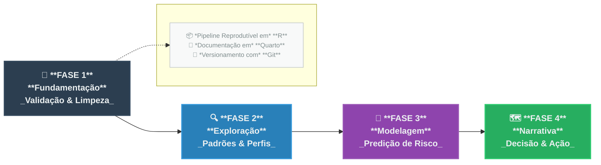

# Plano de Trabalho e Abordagem Estatística – Sistema +BIKE

> Projeto de Análise Exploratória e Modelagem Preditiva
>
> **Ferramentas:** R (Tidyverse, Quarto, Git)
> 
> **Abordagem:** CRISP-DM Adaptado
> 
> **Objetivo:** Traduzir dados operacionais do sistema +BIKE em conhecimento acionável, por meio de análise exploratória e modelagem preditiva.
> 

---

## 1. Introdução

Este documento descreve o plano de trabalho estatístico do projeto **+BIKE**, conforme o problema definido em `00-PROBLEMA.md` e a estrutura de dados apresentada em `01-ESTRUTURA_DADOS.md`.

Como estatístico, abordarei o desafio com técnicas de **análise de dados** e **modelagem preditiva**, aplicadas de forma **reprodutível** na linguagem **R**.

O objetivo é conduzir uma jornada analítica que vai da **validação forense dos dados brutos** à entrega de uma **heurística de decisão operacional**, narrada por meio de técnicas de *Data Storytelling*.

---

## 2. Propósito e Estrutura

O desafio é duplo:

1. **Descrever o passado** – compreender o que *aconteceu* até agosto de 2018, atuando como um “historiador” dos dados.
2. **Prever o futuro** – identificar padrões e estimar comportamentos futuros, atuando como um “profiler” estatístico.

O trabalho será iterativo: cada fase alimenta e refina a seguinte, garantindo um ciclo de aprendizado contínuo.

---

## 3. Fase 1 – Fundamentação: A Realidade por Trás dos Registros

> Antes de calcular médias ou somas, é preciso questionar se os dados refletem a realidade.
> 

A primeira responsabilidade é **auditar a integridade dos dados**. O que os `glimpse()` e `skim()` revelam não são meros erros técnicos, mas cicatrizes do processo de coleta.

### 3.1 Dados Ausentes

- **Análise de padrão:** 25% de valores ausentes em `ride_duration` e `ride_late` devem ser investigados. São *viagens não finalizadas no app*? *Bicicletas extraviadas?* *Falhas de sincronização?*
- **Decisão metodológica:** Remover (`na.omit`) só é válido se a ausência for aleatória (MCAR). Caso contrário, há risco de viés — especialmente se viagens longas falham mais no registro.
- **Exclusão formal:** `user_residence` (62% ausente) será removida do escopo de modelagem, evitando imputações artificiais.

### 3.2 Validade e Anomalias

- **Idades impossíveis:** Datas como *1928* ou *2028* não são outliers, são impossibilidades. Definiremos um intervalo plausível (10–80 anos) com base em regras de negócio.
- **Integridade de chaves:** A *string* de nome da estação é mais confiável que o número (`station_number`) e será tratada como chave primária.

### 3.3 Transformações Conceituais

Converter texto (`chr`) em tempo (`datetime`) é mais que técnico — é conceitual.

Essa transformação permite evoluir de uma visão baseada em *registros* para uma análise de *comportamentos* (fluxos, durações, sazonalidades).

---

## 4. Fase 2 – Exploração: O Diálogo com os Dados

> A estatística começa quando deixamos de contar e passamos a interpretar.
> 

Nesta fase, o foco é **descobrir histórias nos padrões**.

Mais do que médias, buscamos as variações, contrastes e ausências significativas.

### 4.1 O “Quem” – Perfil do Usuário

- Analisar a distribuição real de idades e identificar picos etários.
- Verificar se há subgrupos sub-representados (ex.: mulheres, idosos).
    
    *Ausências também são insights de negócio.*
    

### 4.2 O “Como” e “Quando” – Padrões de Uso

- Identificar assinaturas de comportamento:
    - *Commuting*: picos em horários de trabalho e dias úteis.
    - *Lazer*: uso mais disperso nos fins de semana.
- **Análise multidimensional:** Explorar a interação entre `hora`, `dia_semana` e tipo de estação (parque ou centro comercial) por meio de *heatmaps*.
- **Topologia da rede:** Mapear rotas mais frequentes (*autoestradas*) e estações com desequilíbrio de fluxo (muito recebem, pouco enviam).

### 4.3 Ponte para a Predição

- **Linha de base:** 9,9% das viagens são atrasadas (`ride_late = 1`).
- **Hipótese estatística:** Viagens longas não são aleatórias — são associadas a contextos específicos (ex.: lazer em fins de semana, origem em parques).

---

## 5. Fase 3 – Modelagem: Da Descrição à Predição

> Transformar hipóteses em ferramentas de decisão.
> 

Definimos formalmente um problema de **classificação binária**:

$$
\begin{cases} 
1, & \text{se viagem atrasada} \\
0, & \text{caso contrário}
\end{cases}
$$

### 5.1 Duas Estratégias Complementares

| Objetivo | Tipo de Modelo | Benefício |
| --- | --- | --- |
| **Explicabilidade** | Regressão Logística / Árvore de Decisão | Entender *por que* ocorrem atrasos e quantificar impactos (*Odds Ratio*, SHAP Values). |
| **Performance** | *Ensemble* / *Gradient Boosting* | Detectar interações não-lineares e maximizar a capacidade preditiva. |

### 5.2 Métricas e Validação

- **Desbalanceamento:** 9,9% de eventos positivos — *Acurácia* é irrelevante.
- **Métricas-chave:**
    - AUC-ROC → Poder discriminatório do modelo
    - *Precision–Recall* → Qualidade das previsões positivas
- **Critério de sucesso:** Identificar o *threshold* que captura o **Top 20%** de maior risco (meta operacional definida pelo cliente).

---

## 6. Fase 4 – Narrativa: Da Estatística à Decisão

> A entrega final não é um modelo, mas clareza estratégica.
> 

A fase final traduz o rigor técnico em **insights compreensíveis e aplicáveis**.

A narrativa segue uma estrutura lógica, inspirada no arco de *storytelling*:

1. **O Problema:** Relembrar a dor do negócio (otimização e notificação).
2. **A Descoberta:** Mostrar o perfil do usuário e padrões de comportamento (EDA).
3. **A Tensão:** Apresentar o desafio dos atrasos — *por que ocorrem?*
4. **A Solução:** Introduzir o modelo preditivo como *ferramenta de triagem inteligente*.
5. **A Ação:** Recomendar:
    - Reposições operacionais com base nas rotas.
    - Estratégias de marketing com base nos perfis sub-representados.
    - Regra de notificação no app:
        
        > Ex:. “Notificar viagens cuja probabilidade prevista > threshold (p ≈ 0.38).”
        > 

## 7. Conclusão
Para garantir a **robustez** e **reprodutibilidade** do trabalho, todo o pipeline será implementado em **R**, utilizando pacotes do **Tidyverse** para manipulação e visualização de dados, e documentado em **Quarto** para facilitar a comunicação dos resultados. A versão do código será controlada via **Git**, assegurando rastreabilidade e colaboração eficiente.

> **Síntese:**
> 
>
> Este plano consolida uma abordagem estatística rigorosa e interpretável.
> 
> O resultado esperado é uma análise robusta, defensável e acionável, capaz de converter dados de uso em inteligência de decisão para o sistema +BIKE.

---

## Referências
- Wickham, H., & Grolemund, G. (2017). *R for Data Science: Import, Tidy, Transform, Visualize, and Model Data*. O'Reilly Media, Inc.
- Textclean Package Documentation: https://cran.r-project.org/web/packages/textclean/textclean.pdf
- Tidyverse Package Documentation: https://www.tidyverse.org/
- Data Cleaning Best Practices: https://www.dataquest.io/blog/data-cleaning-best-practices/
- CRISP-DM Methodology Overview: https://www.sv-europe.com/crisp-dm-methodology/
- Data Storytelling Techniques: https://towardsdatascience.com/data-storytelling-techniques-to-make-your-data-pop-5f3f2b8f4b6d
- Model Evaluation Metrics: https://towardsdatascience.com/understanding-evaluation-metrics-for-classification-models-ff9f4d8b6f3c
- mlbench Package Documentation: https://cran.r-project.org/web/packages/mlbench/mlbench.pdf

