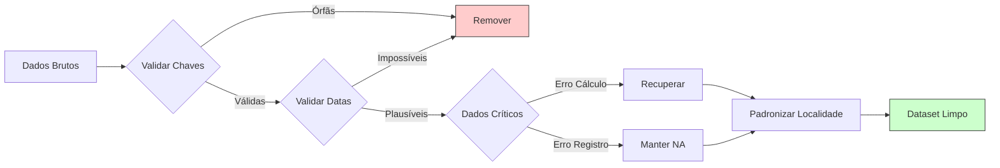
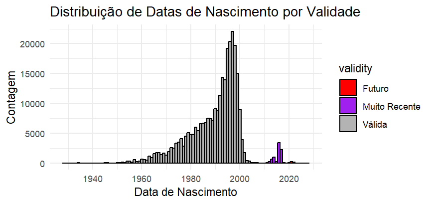
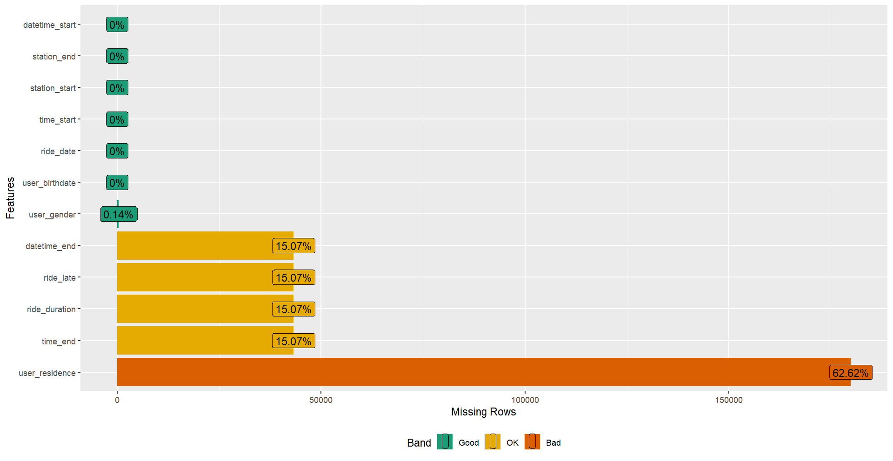
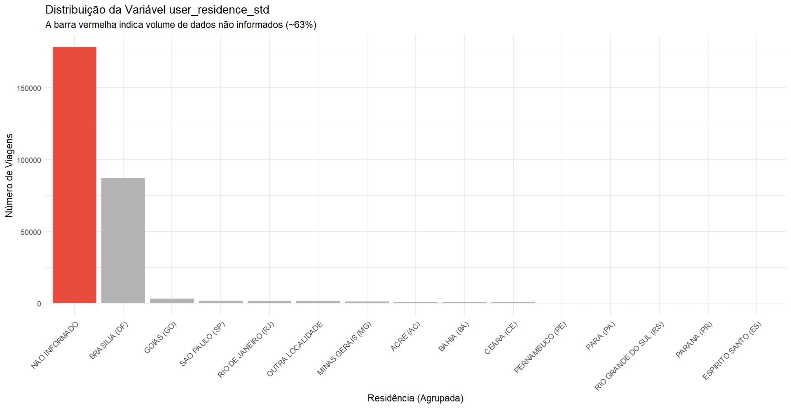
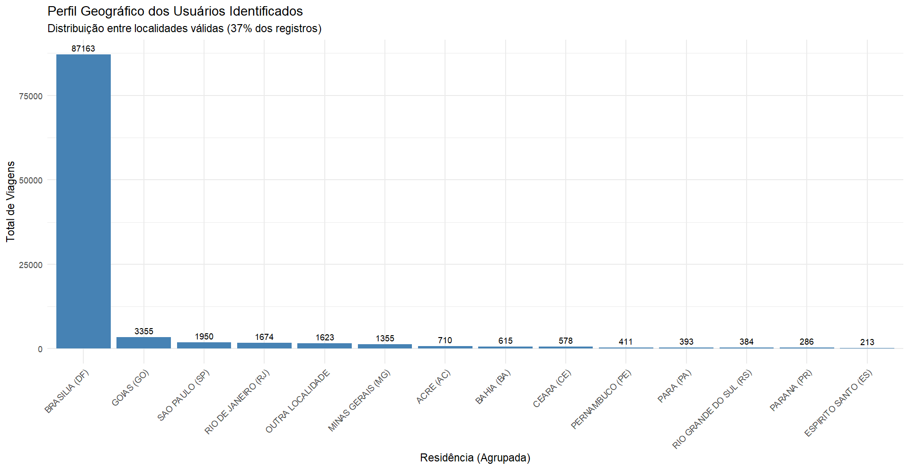

# 🧹 Pipeline de Limpeza e Transformação de Dados

> **Etapa:** Data Cleaning & Feature Engineering  
> **Input:** `df_rides` (Bruto)  
> **Output:** `df_rides_clean` & `df_stations_clen` (Analítico)

---



---

### Objetivo

Após a análise diagnóstica da estrutura dos dados, esta etapa visa **corrigir, padronizar e preparar** o conjunto de dados para as fases de **Análise Exploratória** e **Modelagem Preditiva**.

O propósito da limpeza é eliminar ruídos e inconsistências que comprometam a integridade analítica, **sem distorcer a realidade observada**.

Trata-se, portanto, de uma etapa de **cirurgia analítica**, não de maquiagem de dados.

---

### Metodologia

A limpeza segue as **quatro classes de inconsistências** identificadas durante o Data Profiling (arquivo `02-ANALISE-DIAGNOSTICA.md`):

1. **Integridade Referencial (Chaves “Órfãs”)**
2. **Validade de Dados (Valores Impossíveis)**
3. **Parsing e Completude Crítica (Ausências em Variáveis-Alvo)**
4. **Completude Demográfica (Ausência Sistemática em `user_residence`)**

Cada uma dessas inconsistências é tratada de forma **documentada, reproduzível e justificada**, com decisões baseadas em evidências e na relevância para o problema de negócio.

---


## 1️⃣ Inconsistência de Chave – *Integridade Referencial*

> “Nenhum modelo sobrevive a uma chave quebrada.”

Durante o diagnóstico, foi identificada uma diferença entre o número de estações registradas nas viagens (`df_rides`) e o total oficial (`df_stations`):

```r
skim(df_rides)$n_unique["station_start"] # 50
nrow(df_stations) # 49

```

Para resolver isso, identifica as estações "órfãs" e decidir como tratá-las.
```r
# Identificar estações órfãs
valid_stations <- df_stations$station
orphan_starts <- setdiff(unique(df_rides$station_start), valid_stations) # Identificar órfãs em start
orphan_ends <- setdiff(unique(df_rides$station_end), valid_stations) # Identificar órfãs em end
# Visualizar estações órfãs
orphan_starts
orphan_ends
```
> A saída `[1] "900 - Estação Teste"` é a resposta exata para a "Inconsistência de Chave" que encontramos (as 50 estações únicas nas viagens vs. 49 na lista).

A estação “`900 - Estação Teste`” existe nas viagens, mas **não na tabela de referência** — um registro de teste que não representa uso real.

🔧 **Ação tomada:**

Para qualquer análise exploratória de comportamento do usuário ou para uma análise preditiva (como prever a duração da viagem), esses dados de teste são ruído. Eles não representam a realidade do negócio e irão distorcer (enviesar) as médias, medianas e, o mais importante, o modelo preditivo.

A abordagem analiticamente aqui é remover essas viagens do conjunto de dados. A informação perdida é mínima (apenas 9 registros), e o benefício em termos de integridade analítica é significativo.

```r
df_rides <- df_rides %>%
  filter(!(station_start %in% orphan_starts | station_end %in% orphan_ends))

```

✅ **Resultado:** 9 registros removidos.

O conjunto agora mantém apenas estações válidas, garantindo integridade referencial.

---

## 2️⃣ Inconsistência de Validade – *Datas Impossíveis*

> "A demografia exige plausibilidade biológica."

Durante a análise diagnóstica, identificamos registros na variável `user_birthdate` que resultam em idades impossíveis para a utilização do sistema, como usuários nascidos em **1915** (103 anos) ou **2028** (viajantes do tempo).

Esses valores distorcem o cálculo da idade, uma variável preditora fundamental para o modelo de risco.

Para resolver isso, precisamos primeiro estabelecer **Limites de Plausibilidade** baseados em regras de negócio:

1. **Futuro:** Ninguém pode ter nascido após a data da viagem (Ago/2018).
2. **Idade Máxima:** Assumimos **~100 anos** (nascidos antes de 1920) como limite superior confiável.
3. **Idade Mínima:** Assumimos **8 anos** (nascidos após 2010) como idade mínima física para operar as bicicletas do sistema.

Uma auditoria nos dados revelou a dimensão do problema:
```r
# 2. Investigar idades inválidas
# Definir data limite (fim de agosto de 2018)
cutoff_date <- as.Date("2018-08-31")
# Criar variáveis de auditoria
df_audit <- df_rides %>%
  mutate(
    age = as.numeric(floor(interval(user_birthdate, ride_date) / years(1))),
    birth_future = user_birthdate > cutoff_date,
    birth_too_old = user_birthdate < as.Date("1920-01-01"), # raríssimo ter >100 anos
    birth_too_young = user_birthdate > as.Date("2010-01-01"), # <8 anos em 2018
    birth_missing = is.na(user_birthdate),
    birth_invalid = birth_future | birth_too_old | birth_too_young
  )
# Tabela resumo de registros problemáticos
df_audit %>%
  summarize(
    total = n(),
    missing = sum(birth_missing, na.rm = TRUE),
    future = sum(birth_future, na.rm = TRUE),
    too_old = sum(birth_too_old, na.rm = TRUE),
    too_young = sum(birth_too_young, na.rm = TRUE),
    invalid_total = sum(birth_invalid, na.rm = TRUE),
    pct_invalid = round(100 * invalid_total / total, 2)
  )
```
> A análise gráfica (abaixo) confirma a existência de três clusters de erro: datas futuras, idades centenárias improváveis e crianças pequenas.




```r
# Visualizar distribuição de datas de nascimento inválidas
df_audit %>%
  mutate(validity = case_when(
    birth_future ~ "Futuro",
    birth_too_old ~ "Muito Antiga",
    birth_too_young ~ "Muito Recente",
    TRUE ~ "Válida"
  )) %>%
  ggplot(aes(x = user_birthdate, fill = validity)) +
  geom_histogram(binwidth = 365, color = "black") +
  labs(title = "Distribuição de Datas de Nascimento por Validade",
       x = "Data de Nascimento", y = "Contagem") +
  scale_fill_manual(values = c("Válida" = "gray70", "Futuro" = "red", 
                               "Muito Antiga" = "orange", "Muito Recente" = "purple")) +
  theme_minimal()
# 2.95% (8477) de datas inválidas (< 8 anos ou > 100 anos)
```

> Após a investigar a coluna separadamente, identificamos que 2.95% dos registros possuem datas de nascimento inválidas, conforme a imagem.


🔧 **Ação tomada:**

Dado que a idade é uma das variável preditora crítica para o modelo, e que essas datas são logicamente impossíveis, a abordagem recomendada é remover esses registros do conjunto de dados. Isso garantirá que o modelo seja treinado apenas com dados válidos e confiáveis.

```r  
# Remover registros com datas de nascimento inválidas
df_rides <- df_rides %>%
  filter(!(user_birthdate > cutoff_date | 
           user_birthdate < as.Date("1920-01-01") | 
           user_birthdate > as.Date("2010-01-01")))
``` 

✅ **Resultado:** 8.477 registros removidos.

Isso representa **2,95%** da base original. O conjunto de dados agora possui apenas idades demograficamente coerentes, garantindo que a média e a distribuição de idades reflitam a realidade.

---


## 3️⃣ Inconsistências de Parsing e *Dados Críticos Ausentes*

> **“Um dado ausente é uma decisão adiada — até que ele afete o modelo.”**

Durante a etapa de diagnóstico, foi identificado que as variáveis críticas `time_end`, `ride_duration` e `ride_late` apresentavam um volume expressivo de valores ausentes e inconsistências lógicas.

Essas variáveis são centrais para qualquer análise operacional, modelagem preditiva ou avaliação de desempenho do sistema.

Tratar essas variáveis exige cautela metodológica extrema: eliminar 25% da base sem diagnóstico seria perder informação valiosa; imputar a média seria criar ficção analítica.

Após a retirada das datas de nascimento impossíveis (Inconsistência 2), restaram 71.179 registros com falhas relacionadas ao tempo. 
A primeira tarefa foi quantificar essas ausências e entender como elas se relacionam entre si:

```r
na_summary <- sapply(
  df_rides_clean[, c("time_end", "ride_duration", "ride_late")],
  function(x) sum(is.na(x))
)

print(na_summary)
```
A saída sugere que o problema não está isolado em `ride_duration`, mas sim propagado a partir de `time_end`, que impede o cálculo da duração e, portanto, da variável de atraso.

Para confirmar essa hipótese, avaliou-se quantos dos valores ausentes de `ride_duration` derivam diretamente da ausência de `time_end` ou `datetime_end`:

```r
overlap_nas <- df_rides_clean %>%
  filter(is.na(ride_duration)) %>%
  summarise(
    total_linhas       = n(),                               # total de NAs em ride_duration
    sum_in_time_end    = sum(is.na(time_end)),              # quantos também têm time_end NA
    sum_in_datetime_end = sum(is.na(datetime_end))          # confirmação no datetime
  )

print(overlap_nas)
```

A análise matemática revela que o problema não é único, mas se divide em dois fenômenos distintos:

$$
\text{Total Ausente (71.179)} = \underbrace{\text{Falha de Registro (42.239)}}_{\text{time\_end é NA}} + \underbrace{\text{Falha de Cálculo (28.940)}}_{\text{time\_end existe, mas duração é NA}}
$$

O que sugere duas categorias de tratamento:

1. **Grupo A — Falha de Registro (42.239 viagens):** `datetime_end` está ausente. Sem horário de término, não há como recuperar a duração.
Tratamento recomendado: manter como `NA` e classificar como “viagens não finalizadas” para a análise exploratória.


2. **Grupo B — Falha de Cálculo (28.940 viagens):** O horário final existe, mas `ride_duration` está ausente.

Por que o sistema falharia em calcular a duração se os horários existem?

```r
# Investigar o Grupo B (viagens com erro de cálculo)

group_b_issues <- df_rides_clean %>%
  filter(!is.na(time_end) & is.na(ride_duration))

group_b_summary <- group_b_issues %>%
  summarize(
    total             = n(),
    missing_start     = sum(is.na(time_start)),                           # casos corrompidos no início da viagem
    end_before_start  = sum(!is.na(time_start) & time_end < time_start),  # casos com time_end < time_start
    zero_duration     = sum(!is.na(time_start) & time_end == time_start)  # casos de duração zerada
  )

print(group_b_summary)

``` 
**A Descoberta:** 

Em 99,8% desses casos, o horário de término registrado era anterior ao horário de início (Inversão Temporal).
Estes dados NÃO estão perdidos. Eles estão apenas mal formatados. A intenção do registro é clara: o `time_start` e `time_end` foram muito provavelmente trocados durante a entrada ou o sistema original tentou calcular fim - inicio, obteve um valor negativo e retornou NA por segurança.


🔧 **Ação tomada:**

Já que se trata de um conjunto significativo dos dados (25,5% do total), e que impacta diretamente as variáveis-alvo, a medida é corrigir esses registros onde possível.

Para recuperar informação sem violar plausibilidade operacional, adotamos um algoritmo em três camadas:

  a. Cálculo direto – quando `end ≥ start`.

  b. *Overnight* – adicionar +1 dia ao end em casos plausíveis de travessia da meia-noite.

  c. *Swap* – inverter start e end quando há forte evidência de troca de campos.

Toda a operação foi realizada mantendo variáveis originais para auditoria futura:

```r
# Parâmetros de plausibilidade (ajuste conforme domínio)
max_duration_mins <- 12 * 60   # duração máxima plausível = 12 horas (em minutos)
overnight_limit_hours <- 16    # se +1 dia produzir >16h, suspeitar (ajustar se necessário)

# 0) Preparação e preservação dos originais
# - preserva colunas originais para auditoria: datetime_start_orig, datetime_end_orig, ride_duration_orig, ride_late_orig
df_rides_clean <- df_rides_clean %>%
  mutate(
    datetime_start_orig = datetime_start,
    datetime_end_orig   = datetime_end,
    ride_duration_orig  = ride_duration,
    ride_late_orig      = ride_late,
    # flags iniciais de presença
    start_missing = is.na(datetime_start_orig),
    end_missing   = is.na(datetime_end_orig)
  )

```
Aplicação do algoritmo completo (direct → overnight → swap):

```r
# 1) Cálculo direto (casos normais: end >= start)
# - duration_direct_mins: diferença direta (end - start) em minutos
# - duration_direct_ok: TRUE se diferença estiver entre 0 e max_duration_mins
df_rides_clean <- df_rides_clean %>%
  mutate(
    duration_direct_mins = as.numeric(difftime(datetime_end_orig, datetime_start_orig, units = "mins")),
    duration_direct_ok = !is.na(duration_direct_mins) &
      duration_direct_mins >= 0 &
      duration_direct_mins <= max_duration_mins
  )

# 2) Tentativa overnight (travessia de meia-noite)
# - datetime_end_plus1: adiciona 1 dia quando end < start (apenas para teste)
# - duration_overnight_mins: diferença após +1 dia
# - duration_overnight_ok: aceitável dentro de limites
df_rides_clean <- df_rides_clean %>%
  mutate(
    datetime_end_plus1 = if_else(
      !is.na(datetime_end_orig) & !is.na(datetime_start_orig) & (datetime_end_orig < datetime_start_orig),
      datetime_end_orig + days(1),
      datetime_end_orig
    ),
    duration_overnight_mins = as.numeric(difftime(datetime_end_plus1, datetime_start_orig, units = "mins")),
    duration_overnight_ok = !is.na(duration_overnight_mins) &
      duration_overnight_mins > 0 &
      duration_overnight_mins <= max_duration_mins &
      duration_overnight_mins <= overnight_limit_hours * 60
  )

# 3) Tentativa swap (start e end trocados)
# - duration_swap_mins: calcula start - end (se direct e overnight não OK)
# - duration_swap_ok: validade do swap dentro de limites
df_rides_clean <- df_rides_clean %>%
  mutate(
    duration_swap_mins = if_else(
      (!duration_direct_ok & !duration_overnight_ok) &
        !is.na(datetime_start_orig) & !is.na(datetime_end_orig),
      as.numeric(difftime(datetime_start_orig, datetime_end_orig, units = "mins")),
      NA_real_
    ),
    duration_swap_ok = !is.na(duration_swap_mins) &
      duration_swap_mins > 0 &
      duration_swap_mins <= max_duration_mins
  )

# 4) Seleção da duração final (prioridade)
# - prioridade: ride_duration_orig (se já existia) > direct > overnight_adjust > swapped > NA (unresolved)
df_rides_clean <- df_rides_clean %>%
  mutate(
    ride_duration_fixed_mins = case_when(
      !is.na(ride_duration_orig) ~ ride_duration_orig,     # conserva se já havia
      duration_direct_ok       ~ duration_direct_mins,     # caso normal
      duration_overnight_ok    ~ duration_overnight_mins,  # travessia de meia-noite
      duration_swap_ok         ~ duration_swap_mins,       # swap plausível
      TRUE                     ~ as.numeric(NA)            # não resolvido
    ),
    correction_method = case_when(
      !is.na(ride_duration_orig)              ~ "original_present",
      duration_direct_ok                      ~ "direct",
      duration_overnight_ok                   ~ "overnight_adjust(+1d)",
      duration_swap_ok                        ~ "swapped",
      start_missing | end_missing             ~ "missing_start_or_end",
      TRUE                                    ~ "unresolved"
    )
  )

# 5) Sobrescrever ride_duration com valor corrigido (em minutos)
df_rides_clean <- df_rides_clean %>%
  mutate(
    ride_duration = ride_duration_fixed_mins
  )

# 6) Recalcular ride_late com regra operacional ( > 60 minutos )
# - mantém valores originais quando já existiam
df_rides_clean <- df_rides_clean %>%
  mutate(
    ride_late = case_when(
      !is.na(ride_late_orig)                   ~ ride_late_orig,           # mantém se já havia
      !is.na(ride_duration_fixed_mins)         ~ (ride_duration_fixed_mins > 60),
      TRUE                                     ~ NA
    ),
    was_corrected = correction_method %in% c("overnight_adjust(+1d)", "swapped")
  )

```
Para garantir a validade das correções, executou-se um relatório completo de QA:

```r
# Relatório de QA pós-correção
qa_counts <- df_rides_clean %>%
  count(correction_method) %>%
  arrange(desc(n))
print(qa_counts)

qa_duration_stats <- df_rides_clean %>%
  summarize(
    min_duration = min(ride_duration, na.rm = TRUE),
    q1 = quantile(ride_duration, 0.25, na.rm = TRUE),
    median = median(ride_duration, na.rm = TRUE),
    q3 = quantile(ride_duration, 0.75, na.rm = TRUE),
    max_duration = max(ride_duration, na.rm = TRUE),
    na_duration = sum(is.na(ride_duration))
  )
print(qa_counts)

qa_late_check <- df_rides_clean %>%
  mutate(check_late = if_else(!is.na(ride_duration), ride_duration > 60, NA)) %>%
  summarize(inconsistentes = sum((ride_late != check_late) & !is.na(ride_late) & !is.na(check_late)))
print(qa_late_check)
```
Os números se encaixam perfeitamente nas hipóteses iniciais:

- **Grupo A (irrecuperáveis):** 42.239
- **Grupo B (corrigidos):** 28.884
- **Casos não resolvidos:** 56 (0,02%) – mantidos como NA

Validação da coerência com a regra operacional de atraso:

```r
# Validação da coerência de ride_late
qa_late_check <- df_rides_clean %>%
  mutate(check_late = if_else(!is.na(ride_duration), ride_duration > 60, NA)) %>%
  summarize(inconsistentes = sum((ride_late != check_late) & !is.na(ride_late) & !is.na(check_late)))
print(qa_late_check)
```
 **✅ Resultado**

- **28.884 registros** recuperados com sucesso (antes marcados como NA).
- **42.239 viagens** classificadas como *irrecuperáveis* (ausência real de registro).
- **Apenas 56 casos** permanecem sem solução lógica.
- Nenhuma inconsistência com a regra operacional de atraso.
- Redução de 25,5% para **~15%** de registros críticos ausentes.

Essa intervenção devolve cerca de **30 mil observações** ao conjunto modelável, fortalecendo análises exploratórias, modelagem preditiva e interpretação operacional.




---

## 4️⃣ Inconsistência de Completude – *Demografia*


> “Quando a variabilidade semântica supera a informatividade, o dado deixa de descrever — e começa a confundir.”
> 

A variável `user_residence` representa o local de residência dos usuários.

Ela é relevante para análises territoriais (ex.: demanda por região), segmentação comportamental e modelos que incorporam variáveis geográficas.

Entretanto, o diagnóstico inicial revelou duas anomalias:

1. **Altíssima taxa de ausência** (63,8% dos registros)
2. **Variação semântica extrema**, com mais de **200 formas diferentes** de representar localidades simples, como "Brasília".

Essa combinação torna a variável totalmente inutilizável na forma bruta.


**Diagnóstico Inicial**

```r
df_rides_clean %>%
  count(user_residence, sort = TRUE) %>%
  head(20)

```

**Resultado resumido:**

- **177.943** valores ausentes
- Representações inconsistentes: `"Brasília"`, `"BRASILIA"`, `"brasilia"`, `"BRASÍLIA"`, `"Brasilia-DF"`, `"bsb"`, `"df"`
- Ruídos graves: e-mails, textos genéricos, erros de digitação, localidades inexistentes

Uma síntese estatística das ausências:

```r
df_rides_clean %>%
  summarise(
    total_registros = n(),
    n_ausentes      = sum(is.na(user_residence)),
    pct_ausentes    = round(100 * mean(is.na(user_residence)), 2),
    n_distintos     = n_distinct(user_residence, na.rm = TRUE)
  )

```

**Saída:**

- 278.835 registros
- **63,82% ausentes**
- **231 valores distintos** entre os informados


Para avaliar se a ausência é aleatória ou sistemática, comparou-se o comportamento entre usuários com e sem essa informação:

```r
df_rides_clean %>%
  mutate(residence_missing = is.na(user_residence)) %>%
  group_by(residence_missing) %>%
  summarize(
    total             = n(),
    avg_ride_duration = mean(ride_duration, na.rm = TRUE),
    pct_late          = mean(ride_late, na.rm = TRUE) * 100
  )

```

**Encontramos:**

| Ausência? | Duração Média | % Atraso |
| --- | --- | --- |
| Não | 29,1 min | 9,42% |
| Sim | 29,7 min | 9,90% |

> ➡ **Conclusão:** A ausência não parece MCAR (Missing Completely At Random).

Há diferenças sistemáticas no comportamento.


Explorar os valores informados para entender a variabilidade semântica.
Primeiro, investigamos padrões suspeitos em `user_residence`.

```r
res_check <- df_rides_clean %>%
  mutate(
    has_email  = str_detect(user_residence, "@"),
    has_number = str_detect(user_residence, "\\d"),
    has_symbol = str_detect(user_residence, "[[:punct:]]")
  ) %>%
  summarise(
    emails   = sum(has_email, na.rm = TRUE),
    numeros  = sum(has_number, na.rm = TRUE),
    simbolos = sum(has_symbol, na.rm = TRUE)
  )

```

**Resultado:**

- **17 e-mails** como residência
- **104 entradas com números** (ex.: “Planaltina Norte 02”)
- **232 com símbolos**, incluindo HTML encoding e acentuação defeituosa

Além disso, a amostragem aleatória confirma o ruído:

```r
df_rides_clean %>%
  distinct(user_residence) %>%
  sample_n(20)

```

Exemplos encontrados:

- `"BRASÍLIA"`
- `"BRASILIA - DF"`
- `"brasilia"`
- `"ceilandia norte"`
- `"VALPARAÍSO DE GOIÁS"`
- `"lilicavida@hotmail.com"`
- `"xxx"`

> ➡ **A variável não possui padronização mínima.**

**Estratégia de Padronização Robusta**

O processo adotado envolve **três etapas complementares**:

#### **Etapa 1 — Limpeza Estrutural**

Normalização de capitalização, encoding e remoção de HTML:

```r
df_rides_clean <- df_rides_clean %>%
  mutate(
    res_raw = as.character(user_residence),
    res_norm = res_raw |>
      textclean::replace_html() |>
      str_to_upper() |>
      stringi::stri_trans_general("Latin-ASCII") |>
      str_squish(),
    res_temp = res_norm
  )

```


#### **Etapa 2 — Padronização Semântica e Agrupamento Geográfico**

A regra estabelecida prioriza:

1. **Distrito Federal e cidades satélites** → “BRASILIA (DF)”
2. **Entorno de GO** → “GOIAS (GO)”
3. **Estados mais comuns**, com formas alternativas agrupadas
4. **Detecção de ruído → NA**
5. **Valores pouco frequentes → OUTRA LOCALIDADE**

Código aplicado:

```r
df_rides_clean <- df_rides_clean %>%
  mutate(
    user_residence_std = case_when(
      
      is.na(res_temp) ~ NA_character_,
      res_temp %in% invalid_values ~ NA_character_,
      
      # DF
      res_temp %in% df_values_df ~ "BRASILIA (DF)",
      str_detect(res_temp, paste(df_sat, collapse = "|")) ~ "BRASILIA (DF)",
      
      # GO e Entorno
      res_temp %in% go_values ~ "GOIAS (GO)",
      str_detect(res_temp, paste(go_entorno, collapse = "|")) ~ "GOIAS (GO)",
      
      # Estados
      res_temp %in% map_sp ~ "SAO PAULO (SP)",
      res_temp %in% map_rj ~ "RIO DE JANEIRO (RJ)",
      res_temp %in% map_mg ~ "MINAS GERAIS (MG)",
      res_temp %in% map_ba ~ "BAHIA (BA)",
      res_temp %in% map_ac ~ "ACRE (AC)",
      res_temp %in% map_pe ~ "PERNAMBUCO (PE)",
      res_temp %in% map_ce ~ "CEARA (CE)",
      res_temp %in% map_pa ~ "PARA (PA)",
      res_temp %in% map_rs ~ "RIO GRANDE DO SUL (RS)",
      res_temp %in% map_pr ~ "PARANA (PR)",
      res_temp %in% map_es ~ "ESPIRITO SANTO (ES)",
      res_temp %in% map_ma ~ "MARANHAO (MA)",
      res_temp %in% map_mt ~ "MATO GROSSO (MT)",
      res_temp %in% map_rr ~ "RORAIMA (RR)",
      
      # Siglas genéricas
      nchar(res_temp) == 2 ~ res_temp,
      
      TRUE ~ "OUTRA LOCALIDADE"
    )
  ) 

```


#### **Etapa 3 — Consolidação Estatística**

- Conversão para fator
- Substituição de NA por categoria explícita
- Agrupamento mínimo (≥ 200 observações)

```r
df_rides_clean -> df_rides_clean %>%
  # Refinamento de Fatores 
  mutate(
    user_residence_std = user_residence_std %>% 
      fct_na_value_to_level(level = "NAO INFORMADO") %>%  
      fct_lump_min(min = 200, other_level = "OUTRA LOCALIDADE")
  ) %>%
  select(-res_temp)


```

**Análise Pós-Limpeza**


```r
df_rides_clean %>%
  count(user_residence_std, sort = TRUE)

```

Visualizações mostram o impacto:

### **(1) Panorama geral (inclui NAO INFORMADO)**



- A barra vermelha representa os **63% de dados ausentes**
- As demais barras mostram os clusters semânticos consolidados

```r
# (1) Panorama geral, destacando a ausência de dados
ggplot(df_rides_clean, aes(x = fct_infreq(user_residence_std))) +
  geom_bar(fill = "gray70") +
  geom_bar(
    data = subset(df_rides_clean, user_residence_std == "NAO INFORMADO"),
    fill = "#E74C3C"
  ) +
  labs(
    title = "Distribuição da Variável user_residence_std",
    subtitle = "A barra vermelha indica volume de dados não informados (~63%)",
    x = "Residência (Agrupada)",
    y = "Número de Viagens"
  ) +
  theme_minimal() +
  theme(axis.text.x = element_text(angle = 45, hjust = 1))

```

### **(2) Perfil geográfico apenas dos dados válidos (37%)**



- Evidencia concentração no DF e Entorno

```r
# (2) Perfil geográfico entre registros válidos
df_rides_clean %>%
  filter(user_residence_std != "NAO INFORMADO") %>%
  ggplot(aes(x = fct_infreq(user_residence_std))) +
  geom_bar(fill = "steelblue") +
  geom_text(stat = 'count', aes(label = ..count..),
            vjust = -0.5, size = 3) +
  labs(
    title = "Perfil Geográfico dos Usuários Identificados",
    subtitle = "Distribuição entre localidades válidas (37% dos registros)",
    x = "Residência (Agrupada)",
    y = "Total de Viagens"
  ) +
  theme_minimal() +
  theme(axis.text.x = element_text(angle = 45, hjust = 1))
######

```

---

**🔧 Ação tomada**

✔ Limpeza estrutural profunda

✔ Normalização semântica

✔ Agrupamento geográfico coerente

✔ Remoção explícita de ruído

✔ Criação da nova variável confiável: **`user_residence_std`**

A variável original permanece disponível para auditoria, caso necessária.


**✅ Resultado Final**

- **231 categorias sujas** reduzidas para **menos de 15 agrupamentos úteis**.
- **63% de ausentes** agora representados explicitamente como `NAO INFORMADO`.
- Redução drástica de ruído semântico (correções de acentos, HTML encoding, *lowercase/uppercase*, erros de digitação).
- Variável agora **segura para utilização** em análises exploratórias, gráficos e modelos preditivos.

> Esta etapa converte uma variável praticamente inutilizável em um atributo informativo e padronizado, alinhado às exigências de consistência da engenharia de dados.


> Mesmo que o impacto dessa variável seja limitado (37% preenchidos), ela permite hipóteses relevantes na EDA:
>
>  - O usuário “**NAO INFORMADO**” tende a atrasar mais a devolução?
> - O “**Turista**” (`OUTRA LOCALIDADE`) faz viagens mais longas nos fins de semana?

Essas perguntas definem o valor analítico da variável, orientando se ela deve ou não ser mantida no modelo preditivo.

---

### ✅ Conclusão da Etapa

> O foco não é apenas “limpar dados”, mas tornar o ruído mensurável e útil.
> Cada decisão de limpeza foi tomada com base em evidências, visando preservar a integridade analítica e a relevância do conjunto de dados.
> 
> A coluna `user_residence` agora é confiável, interpretável e analiticamente testável.
> 


### 📦 Dataset Atualizado

| Etapa | Ação Realizada | Resultado |
| --- | --- | --- |
| 1️⃣ Chaves Órfãs | Remoção de registros de teste | –9 registros (Integridade OK) |
| 2️⃣ Datas Inválidas | Filtragem biológica (1920–2010) | –8.477 registros (Validade OK) |
| 3️⃣ Falha de Cálculo | Correção algorítmica de inversão | +29.886 registros recuperados (*Target* OK) |
| 4️⃣ Demografia | Padronização + Explicitação de NAs | Variável pronta para hipótese |

**Dataset final:** `df_rides_clean`

**Total:** 278.836 observações & 15 variáveis

**Status:** ✅ *Pronto para Fase 2 – Análise Exploratória de Dados (EDA)*

> “A limpeza não é o fim da análise, mas o início da compreensão.”

---

Como foi realizada a Análise Exploratória de Dados (EDA)? Veja o arquivo `05-ANALISE-EXPLORATORIA.md`, juntamente com o *script* (código) `02_EDA.R`.

---
--- 

