# 📊 Pipeline de Análise Exploratória – Sistema +BIKE

A etapa de **Análise Exploratória de Dados (Exploratory Data Analysis – EDA)** tem como objetivo investigar, compreender e contextualizar os dados operacionais do sistema +BIKE antes da construção de modelos preditivos.

EDA **não é apenas produzir gráficos ou estatísticas descritivas**.

Trata-se de um processo investigativo destinado a compreender:

- a **estrutura interna dos dados**;
- os **padrões temporais de uso do sistema**;
- possíveis **desequilíbrios operacionais**;
- **anomalias ou inconsistências relevantes**;
- relações **estatísticas plausíveis entre variáveis**;
- hipóteses que expliquem o comportamento observado.

Em termos metodológicos:

- **EDA é um processo indutivo**, orientado à descoberta de padrões.
- **Modelagem estatística é dedutiva**, orientada à formalização dessas hipóteses.

Assim, a EDA funciona como uma **ponte entre os dados brutos e a modelagem preditiva**.

> **EDA → compreensão do sistema → formulação de hipóteses → modelagem**

---

# 🎯 Objetivos da Análise Exploratória

Com os dados previamente limpos e validados nas etapas anteriores, a EDA foi conduzida com dois objetivos centrais.

## 1. Diagnóstico do comportamento do sistema

Esta etapa busca compreender **como o sistema +BIKE é utilizado na prática**, investigando:

- perfil demográfico dos usuários;
- padrões temporais de uso (hora do dia, dia da semana e sazonalidade);
- dinâmica de fluxo entre estações (origem–destino);
- presença de desequilíbrios operacionais na rede;
- indícios de gargalos físicos ou comportamentais.

Essas análises permitem reconstruir **a lógica real de uso do sistema**.

---

## 2. Preparação para a modelagem preditiva

O segundo objetivo da EDA é estruturar o problema analítico que será tratado na etapa de modelagem.

O foco central do projeto é compreender e prever **viagens que excedem o limite operacional de 60 minutos**.

Assim, a EDA busca:

- formalizar a variável **`ride_late`** como indicador binário de atraso;
- investigar fatores associados ao aumento de risco;
- identificar variáveis explicativas disponíveis **no momento da retirada da bicicleta**;
- estabelecer uma linha de base para a modelagem.

Esse processo permitirá posteriormente estimar:

$$
P(Atraso=1∣X)P(\text{Atraso} = 1 \mid X)
$$

em que $X$ representa o conjunto de informações observáveis **antes da viagem ocorrer**.

---

# 🧭 Metodologia de Exploração

A análise exploratória foi estruturada em quatro blocos principais:

1. **Análise univariada**
    
    investigação das distribuições individuais das variáveis.
    
2. **Análise bivariada**
    
    exploração de relações entre variáveis relevantes.
    
3. **Visualização exploratória**
    
    uso de gráficos para revelar padrões não evidentes em tabelas.
    
4. **Análise temporal e de rede**
    
    investigação da dinâmica do sistema ao longo do tempo e do espaço.
    

Durante todo o processo foi mantida uma separação clara entre:

- **Fundamentação analítica** – validação estrutural dos dados
- **Exploração estatística** – identificação de padrões e hipóteses
- **Modelagem** – etapa posterior de formalização preditiva
- **Narrativa analítica** – tradução dos resultados em insights acionáveis

---

# 1️⃣ Integridade Analítica e Natureza dos Missing

Antes da exploração estatística propriamente dita, foi necessário compreender a **natureza das ausências presentes na base de dados**.

Nem todo valor ausente representa erro de coleta. Em sistemas operacionais complexos, valores ausentes podem refletir **limitações do processo de registro ou características do próprio sistema**.

A primeira etapa da EDA consistiu, portanto, em classificar os diferentes tipos de *missing values*.

```r
# Remoção de registros estruturalmente inválidos
df_rides<-df_rides%>%
filter(!(!is.na(datetime_end)&is.na(ride_duration)&is.na(ride_late) ))
```

Essa operação remove um pequeno subconjunto de registros inconsistentes, nos quais o horário de término está presente, mas a duração da viagem e o indicador de atraso não foram calculados.

---

## Tipologia de Missing Identificada

| Variável | Tipo de ausência | Natureza |
| --- | --- | --- |
| `datetime_end` | Falha operacional | MNAR sistêmico |
| `ride_duration` | Variável derivada | Dependente |
| `ride_late` | Variável derivada | Dependente |
| `user_gender` | Cadastro incompleto | MNAR estrutural |

---

## 🕒 Caso Crítico: `datetime_end`

Cerca de **15% das viagens apresentam ausência do timestamp de encerramento**, apesar de a devolução da bicicleta ter sido registrada.

Isso indica que o evento físico ocorreu, mas o sistema não conseguiu registrar o horário exato.

Esses registros são:

- **espacialmente válidos** (sabemos origem e destino)
- **temporalmente inválidos** (não sabemos a duração exata)

### Interpretação operacional

Esse comportamento é consistente com falhas de sincronização entre a estação física e o sistema central.

Possíveis explicações incluem:

- travamento imperfeito do *dock*;
- validação posterior do evento de devolução;
- registro tardio sem recuperação do timestamp original.

---

## Decisão metodológica

A presença dessas observações exige tratamento diferenciado.

Para análises de:

**Fluxo e rede**

→ as observações são mantidas, pois preservam informação espacial.

**Duração e atraso**

→ as observações são removidas, pois introduziriam viés temporal.

Essa abordagem permite **preservar informação útil sem comprometer a validade estatística das análises temporais**.

---

## Caso residual: registros inconsistentes

Foi identificado um subconjunto de **56 observações estruturalmente inconsistentes**, nas quais:

- `datetime_end` estava presente
- `ride_duration` e `ride_late` estavam ausentes

Esse grupo representa **menos de 0,03% da base de dados** e foi removido por violar regras fundamentais de integridade.

---


# 2️⃣ Engenharia de Features

Para que a análise exploratória fosse capaz de revelar padrões comportamentais relevantes, foi necessário traduzir os registros operacionais em **variáveis analíticas interpretáveis**.

As novas features foram construídas em três dimensões principais:

### Dimensão demográfica

A idade do usuário foi calculada a partir da diferença entre a data de nascimento e a data da viagem.

Além da versão contínua, foram criados agrupamentos etários para explorar possíveis **efeitos não lineares no risco de atraso**.

---

### Dimensão geográfica

A variável de residência foi reinterpretada para capturar o conceito de **familiaridade com a cidade**.

Foram definidos três grupos:

- **Locais (DF)**
- **Não informado**
- **Outros / turistas**

Essa classificação permite investigar se usuários menos familiarizados com o sistema apresentam comportamentos distintos.

---

### Dimensão temporal

O horário de início da viagem foi transformado em componentes trigonométricos (*seno* e *cosseno*), permitindo capturar a **natureza cíclica do tempo**.

Esse tipo de transformação evita a descontinuidade artificial entre 23h e 00h em modelos estatísticos.

```r
df_rides <- df_rides %>%
  mutate(
    # --------------------------------------------------------------------------
    # IDADE — manter sinal contínuo e permitir não-linearidade
    # --------------------------------------------------------------------------
    
    # Idade contínua (variável principal)
    user_age = as.integer(interval(user_birthdate, ride_date) / years(1)),
    
    # Versão normalizada (útil para modelos e comparações)
    user_age_scaled = as.numeric(scale(user_age)),
    
    # Buckets PROVISÓRIOS (exploratórios, não definitivos)
    # Corrigido para usar a função cut() mantendo suas faixas originais
    user_age_group_exp = cut(
      user_age,
      breaks = c(8, 18, 25, 35, 45, 55, 65, 91),
      labels = c("08–17", "18–24", "25–34", "35–44", "45–54", "55–64", "65–90"),
      right  = FALSE
    ),
    
    # --------------------------------------------------------------------------
    # GEOGRAFIA — separar informação, familiaridade e localidade
    # --------------------------------------------------------------------------
    
    # Flag simples: residência informada?
    has_residence_info = user_residence != "NAO INFORMADO",
    
    # Cluster geográfico conceitual (hipótese de familiaridade)
    geo_cluster = case_when(
      user_residence == "BRASILIA (DF)" ~ "Local (DF)",
      user_residence == "NAO INFORMADO" ~ "Não Informado",
      TRUE                              ~ "Outros / Turistas"
    ),
    
    # Versão binária útil para modelos
    is_local_df = user_residence == "BRASILIA (DF)",
    
    # --------------------------------------------------------------------------
    # TEMPO — tratar hora como fenômeno cíclico
    # --------------------------------------------------------------------------
    
    # Hora simples (EDA, gráficos, tabelas)
    hora_inicio = hour(datetime_start),
    
# Componentes cíclicos (modelagem futura)
    hora_inicio_sin = sin(2 * pi * hora_inicio / 24),
    hora_inicio_cos = cos(2 * pi * hora_inicio / 24)
  )
message("✅ Processamento concluído. Dimensões finais: ", nrow(df_rides), " linhas e" , ncol(df_rides), " colunas.")
```

Essas transformações criam uma base analítica mais adequada para exploração estatística e modelagem posterior.

---

# 3️⃣ Análise do Perfil do Usuário (O “Quem”)

Uma das primeiras perguntas da análise exploratória foi compreender **quem utiliza o sistema +BIKE**.

A caracterização do perfil demográfico dos usuários permite identificar padrões de comportamento e possíveis vulnerabilidades operacionais associadas a determinados grupos.

A análise foi conduzida utilizando estatísticas descritivas e comparações bivariadas entre as variáveis demográficas e o indicador de atraso (`ride_late`).

---

## Distribuição Etária

A distribuição de idade dos usuários revela que o sistema é utilizado predominantemente por **adultos jovens**, com forte concentração nas faixas:

- **25–34 anos**
- **35–44 anos**

Esse padrão é consistente com sistemas de bicicletas compartilhadas em grandes centros urbanos, onde o uso tende a ser mais frequente entre indivíduos em idade economicamente ativa, especialmente para deslocamentos cotidianos.

A participação de usuários acima de **60 anos é relativamente pequena**, o que sugere menor adoção do sistema por esse grupo etário. No entanto, mesmo com baixa representatividade, esses usuários apresentam **maior exposição ao risco de atraso**, o que torna esse segmento relevante do ponto de vista operacional.

A análise detalhada por faixa etária revelou um padrão importante:

o risco de atraso não é homogêneo ao longo da distribuição de idade.

Usuários nos **extremos da distribuição etária** apresentam comportamentos distintos:

- Jovens entre **08–17 anos**
- Adultos mais velhos entre **55–64 anos**

Esses grupos apresentam **taxas de atraso sistematicamente maiores**, podendo ultrapassar **20% em alguns intervalos**, sugerindo possíveis diferenças no padrão de uso, na experiência com o sistema ou na velocidade média de deslocamento.

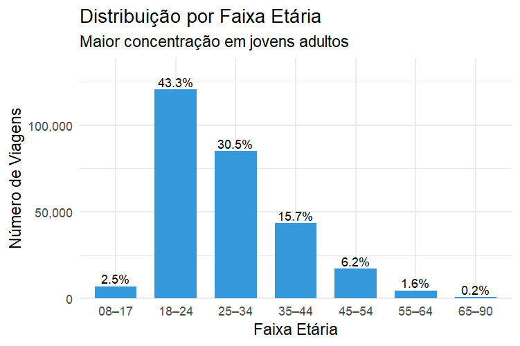


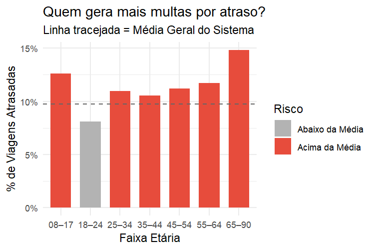

Esse resultado indica que idade atua como um moderador relevante do risco operacional e, portanto, deve ser considerada na etapa de modelagem preditiva.

---

## 🚺 Gênero como Proxy de Infraestrutura

A análise do perfil por gênero revelou uma **forte predominância masculina no uso do sistema**.

Aproximadamente **74% das viagens registradas foram realizadas por homens**, enquanto as mulheres representam cerca de **26% do total de usuários**.

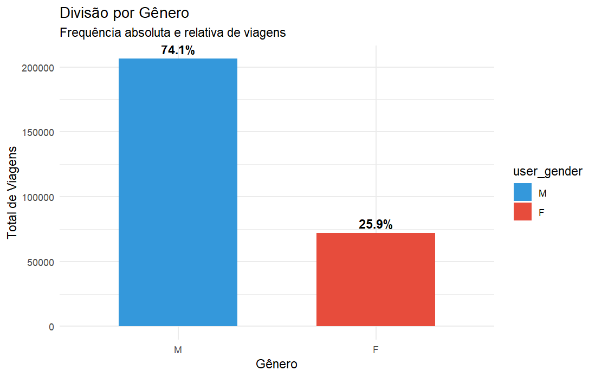

Em estudos de mobilidade urbana, essa proporção é frequentemente utilizada como um **indicador indireto (*proxy*) da qualidade e segurança da infraestrutura cicloviária**.

Em cidades com redes cicloviárias consolidadas e infraestrutura segura, a participação feminina tende a se aproximar da paridade, frequentemente atingindo proporções próximas de **50/50**.

Quando há forte predominância masculina, isso pode refletir:

- **maior percepção de risco no trânsito urbano**;
- **infraestrutura cicloviária insuficiente ou pouco conectada**;
- uso predominantemente **utilitário** do sistema, em vez de recreativo.

No contexto do sistema +BIKE, a análise bivariada revelou ainda que **mulheres tendem a realizar viagens ligeiramente mais longas** e apresentam **taxa média de atraso superior à dos homens**.

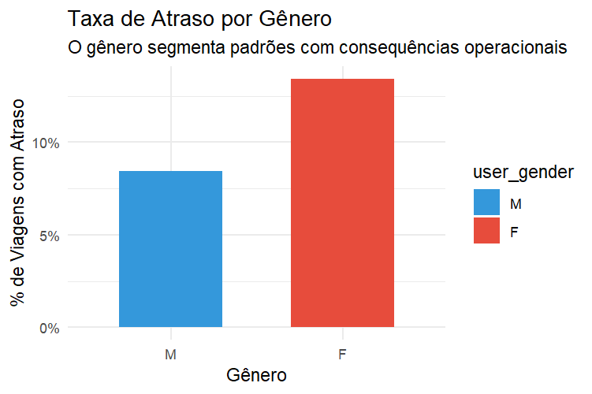

Esse padrão pode estar associado a diferenças de comportamento de uso, escolha de rotas ou maior sensibilidade a problemas operacionais da rede.

---

### Síntese demográfica:

A análise do perfil demográfico revela que o risco de atraso **não está distribuído uniformemente entre os usuários**.

Tanto **idade** quanto **gênero** segmentam padrões distintos de utilização do sistema.

Essas variáveis capturam diferenças importantes no comportamento de uso e na forma como os usuários interagem com as limitações operacionais da rede.

Do ponto de vista analítico, isso implica que essas variáveis **não devem ser ignoradas na modelagem preditiva**, pois ajudam a explicar parte da heterogeneidade observada no risco de atraso.

Em outras palavras, **idade e gênero funcionam como moderadores do risco operacional**, refletindo diferentes níveis de vulnerabilidade dos usuários diante de falhas ou gargalos do sistema.

---

# 4️⃣ Geografia e a Descoberta da “Familiaridade”

Um dos maiores desafios da análise geográfica foi lidar com a variável **residência do usuário**.

A base apresenta um volume extremamente elevado de registros classificados como **“NAO INFORMADO”**, representando aproximadamente **63,9% dos usuários**. Em um primeiro momento, isso poderia ser interpretado como um *missing* problemático, potencialmente limitando qualquer análise baseada em origem geográfica.

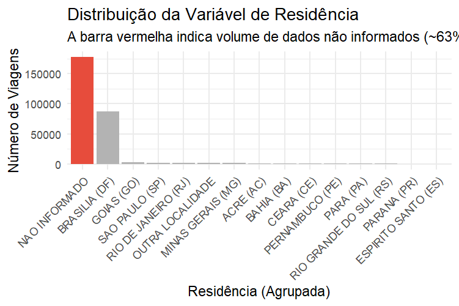

Entretanto, a EDA foi conduzida justamente para testar se esse grupo realmente representava **informação ausente aleatória** ou se havia algum **padrão comportamental escondido nessa categoria**.

Para investigar essa hipótese, os usuários foram agrupados em três clusters geográficos:

- **Locais (DF)** – residência registrada em Brasília
- **Não Informado** – usuários sem informação de residência
- **Outros / Turistas** – usuários registrados em outras cidades ou estados


A análise comparativa entre esses grupos revelou um resultado inesperado e extremamente informativo.

---

## Evidência 1 — Padrão de Duração

A primeira comparação analisou a **distribuição da duração das viagens** entre os grupos.

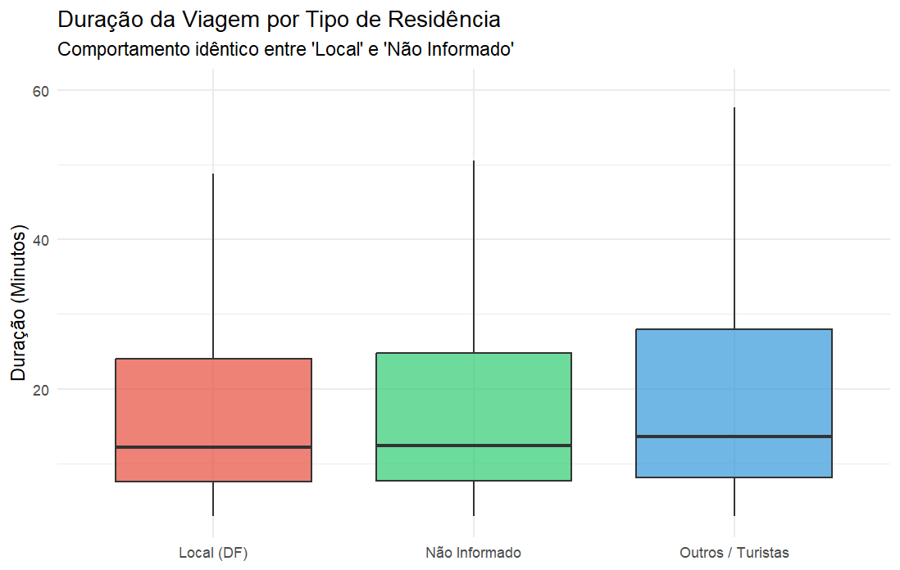

O resultado mostrou que as medianas de duração dos grupos “Locais (DF)” e “Não Informado” são praticamente idênticas, situando-se em torno de 12 minutos, com baixa dispersão.

Esse padrão sugere que ambos os grupos apresentam **comportamento de deslocamento semelhante**, típico de trajetos curtos e funcionais.

Em contraste, o grupo **“Outros / Turistas”** apresenta viagens mais longas, indicando um uso mais associado a lazer ou desinforma.

## Evidência 2 — Curva Horária de Uso

A segunda análise investigou a **distribuição horária das viagens**.

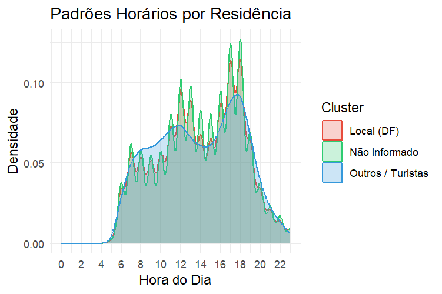

Novamente, os grupos **“Locais (DF)”** e **“Não Informado”** apresentaram comportamento praticamente idêntico.

Ambos exibem **picos de uso claros nos horários de deslocamento pendular**, especialmente:

- início da manhã
- final da tarde

Esse padrão é característico de **uso para mobilidade cotidiana (commuting)**.

<!-- 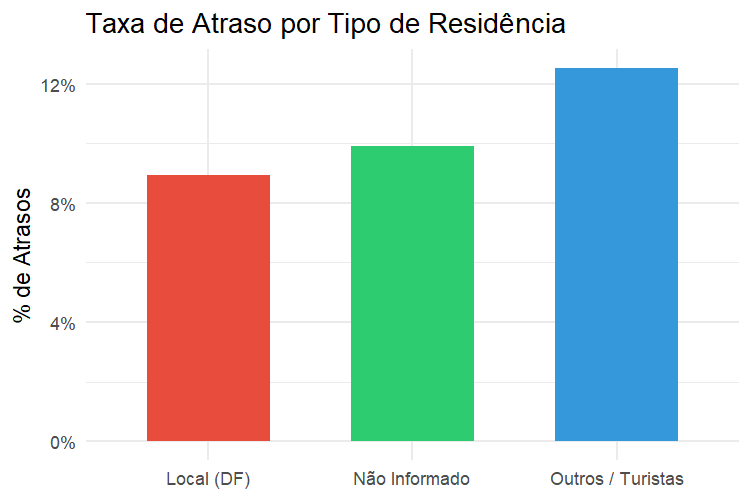 -->

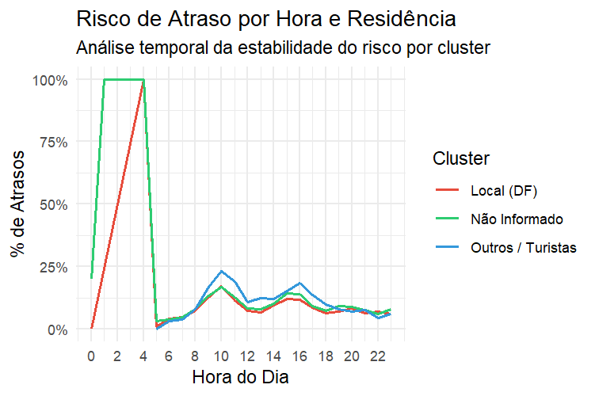

Por outro lado, o grupo “Outros / Turistas” apresenta um padrão distinto, com maior concentração de viagens no período da tarde, indicando um uso mais associado a atividades recreativas.

## Evidência 3 — Curva de Risco de Atraso

A terceira comparação analisou a **taxa de atraso ao longo do dia** para cada cluster geográfico.


Mais uma vez, os grupos **“Locais (DF)”** e **“Não Informado”** apresentam taxas de atraso muito semelhantes ao longo de todo o dia.

Em contraste, o grupo **“Outros / Turistas”** apresenta:

- maior duração média de viagem
- maior dispersão temporal de uso
- **taxa de atraso consistentemente mais elevada**

Enquanto os usuários locais apresentam risco médio de atraso próximo de **8,9%**, o grupo de turistas apresenta valores próximos de **12,5%**.

---

## Interpretação Analítica: A Variável “Não Informado”

A evidência empírica acumulada indica que a categoria **“NAO INFORMADO” não se comporta como um missing aleatório**.

Na prática, esse grupo apresenta **padrões comportamentais praticamente idênticos aos usuários locais**.

Isso sugere que muitos desses registros correspondem simplesmente a **usuários recorrentes que optaram por não preencher ou completar o cadastro de residência**, e não necessariamente a visitantes ou usuários ocasionais.

---

Com base nas evidências observadas na EDA, foi adotada a seguinte estratégia para a modelagem:

- **“Locais (DF)” e “Não Informado”** serão tratados como um mesmo grupo comportamental (usuários locais)
- **“Outros / Turistas”** serão mantidos como um cluster separado

Essa decisão permite preservar a informação comportamental relevante da variável, evitando tratar um grande volume de observações como ruído estatístico.

Além disso, a análise indica que **usuários visitantes apresentam um perfil de uso mais arriscado**, caracterizado por viagens mais longas e maior probabilidade de atraso, tornando esse grupo particularmente relevante para a modelagem de risco operacional.

---

# 5️⃣ Padrões Temporais e Sazonalidade

Após analisar o perfil dos usuários e a dimensão geográfica do sistema, a próxima etapa da EDA buscou responder uma pergunta central:

**Quando o sistema +BIKE apresenta maior probabilidade de atraso?**

A análise da dimensão temporal revelou que o comportamento do sistema não é homogêneo ao longo da semana. Na prática, o sistema opera sob **duas lógicas principais de uso**, associadas ao contexto em que as viagens ocorrem.

---

## Uso Funcional — Dias Úteis

Durante os **dias úteis**, o sistema apresenta características típicas de uso voltado à mobilidade cotidiana.

Observa-se:

- **maior volume absoluto de viagens**;
- **concentração horária nos períodos de pico**, especialmente início da manhã e final da tarde;
- **taxas de atraso relativamente baixas**, geralmente entre **6% e 8%**.

Esse padrão é consistente com deslocamentos regulares associados a **trabalho, estudo ou integração com outros modos de transporte**.

Nesse contexto, as viagens tendem a ser:

- mais curtas
- mais previsíveis
- realizadas em horários bem definidos

Essas características reduzem a probabilidade de desequilíbrios operacionais na rede.

---

## Uso Recreativo — Finais de Semana

Nos **finais de semana**, o comportamento do sistema muda de forma significativa.

A análise mostra:

- **menor volume total de viagens**;
- **maior dispersão horária de uso**;
- **duração média de viagem mais elevada**;
- **aumento expressivo na taxa de atraso**.

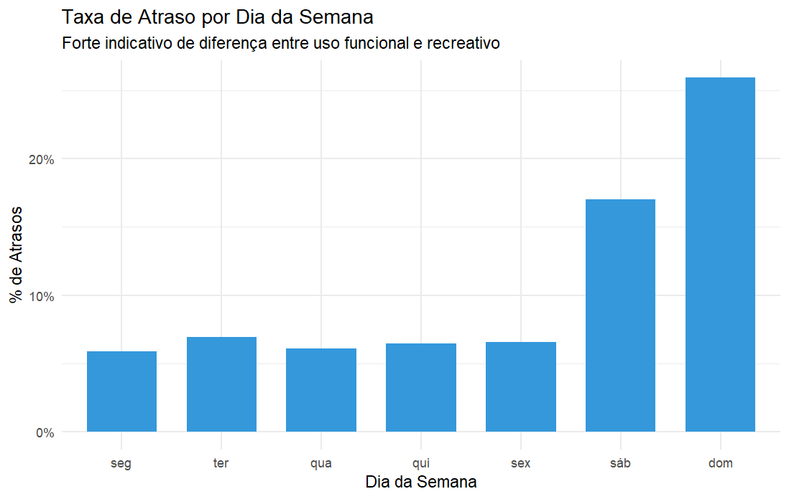

Enquanto em dias úteis a taxa de atraso orbita a casa dos 6% a 8% (uso funcional), nos **finais de semana o risco explode para valores entre 16% e 24%** (uso recreativo).

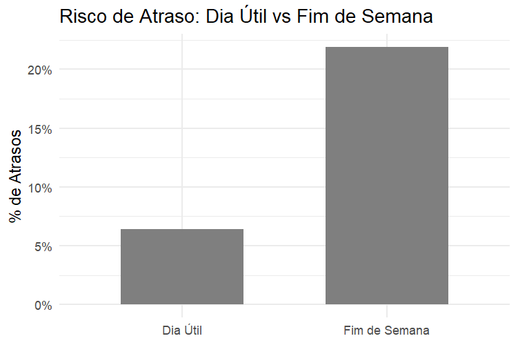

Esse comportamento sugere um padrão de uso predominantemente **recreativo ou turístico**, no qual os usuários permanecem mais tempo com as bicicletas e realizam deslocamentos menos previsíveis.

Como consequência, aumenta a probabilidade de **desequilíbrios temporários na rede de estações**, especialmente em áreas com maior concentração de devoluções.

---

A análise temporal demonstra que o atraso no sistema +BIKE **não ocorre de forma aleatória**.

Ele está **fortemente condicionado ao contexto temporal em que a viagem ocorre**, especialmente:

- **dia da semana**
- **hora do dia**
- **tipo de uso predominante (funcional vs recreativo)**


Esses resultados indicam que **variáveis temporais desempenham papel fundamental na explicação do risco de atraso**, sendo, portanto, componentes essenciais para a etapa de **modelagem preditiva**.

---

> **🚦 Síntese Temporal:**
O atraso não é um ruído estocástico. É um evento previsível, altamente condicionado à janela de tempo (hora/dia) em que a viagem ocorre.

---

# 6️⃣ Diagnóstico Causal: Rede, Estações e Gargalos Físicos

# 6️⃣ Dinâmica da Rede e Gargalos Operacionais

Até este ponto da análise, diversos fatores associados ao atraso já haviam sido identificados — perfil do usuário, contexto temporal e padrões geográficos. No entanto, permanecia uma questão central:

**o atraso ocorre por comportamento do usuário ou por limitações estruturais do sistema?**

A hipótese inicial considerava que viagens longas ou comportamentos individuais pudessem explicar grande parte dos atrasos. Entretanto, a análise espacial e de rede revelou um mecanismo diferente.

Os resultados indicam que o atraso está **fortemente associado à dinâmica física das estações**, especialmente ao equilíbrio entre retiradas e devoluções ao longo da rede.

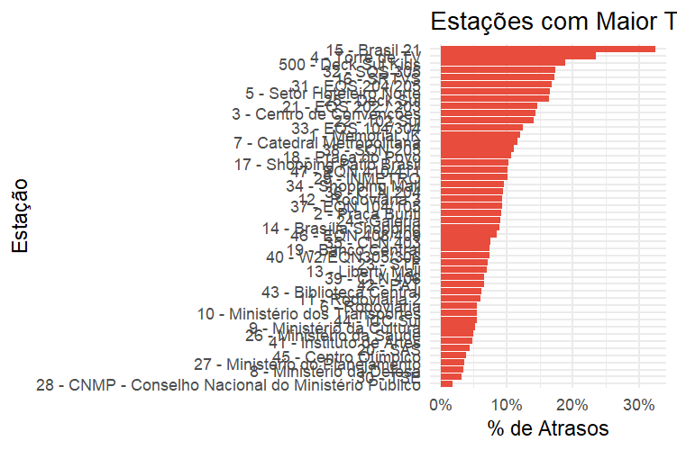
---

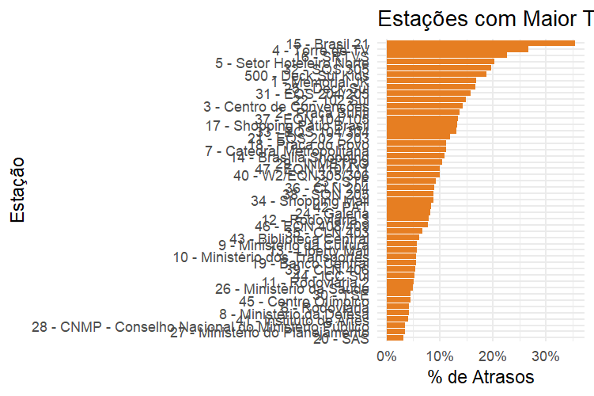
----

Essa evidência sugere que o atraso não emerge apenas de decisões individuais do usuário, mas sim de restrições operacionais do próprio sistema.

### A Dinâmica do Colapso Operacional

A análise exploratória permitiu identificar um **mecanismo estrutural recorrente**, que pode ser descrito como uma cadeia de eventos operacionais.

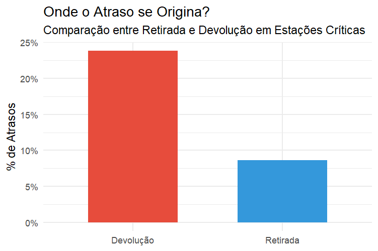
---

1️⃣ **Desequilíbrio de fluxo entre estações**

Algumas estações funcionam predominantemente como **origem**, enquanto outras concentram **devoluções**. Esse desequilíbrio gera acúmulo progressivo de bicicletas em determinados pontos da rede.

---

2️⃣ **Saturação das docas de destino**

Quando muitas bicicletas chegam simultaneamente a uma estação com capacidade limitada, as **docas disponíveis se esgotam**.

Nesse momento, o sistema entra em uma condição de saturação local.

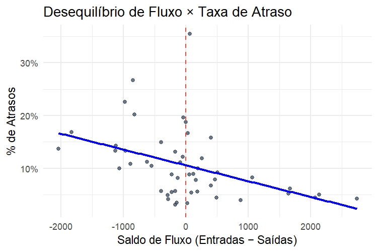
---

3️⃣ **Busca por estação alternativa**

Sem vagas disponíveis na estação planejada, o usuário precisa continuar pedalando até encontrar outra estação com docas livres.

Esse comportamento aumenta artificialmente o tempo total da viagem.

---

4️⃣ **Registro do atraso**

Como consequência, o sistema registra um **tempo de viagem superior ao limite operacional**, classificando a corrida como atraso.

---

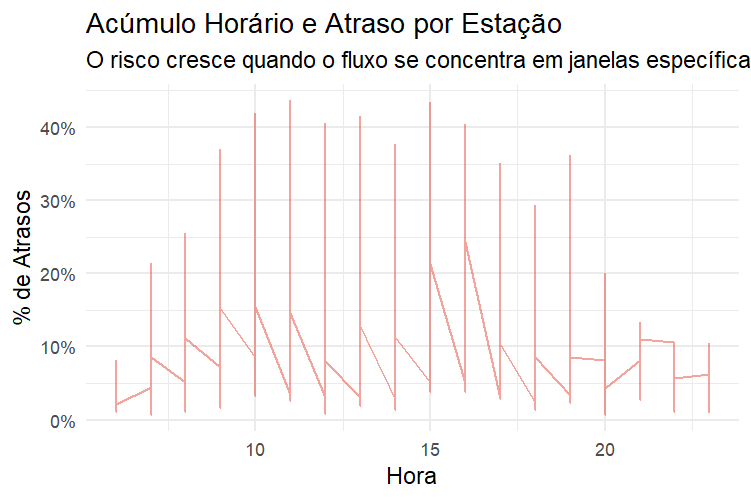
---

---


# 7️⃣ Duração vs. Atraso — Separando Sintoma de Causa

Uma das hipóteses mais importantes investigadas durante a EDA foi a relação entre **duração da viagem** e **ocorrência de atraso**.

A pergunta inicial era direta:

**Viagens mais longas causam atraso no sistema +BIKE?**

Essa hipótese é intuitiva. Se um usuário permanece mais tempo com a bicicleta, seria razoável esperar maior probabilidade de ultrapassar o limite operacional da corrida.

Entretanto, a análise detalhada dos dados revelou uma interpretação diferente.

---

### Evidência Empírica

De fato, as estatísticas descritivas mostram que **viagens longas apresentam maior taxa de atraso**. Enquanto viagens curtas quase nunca ultrapassam o limite de tempo, viagens com maior duração apresentam taxas de atraso significativamente mais elevadas.

Esse padrão poderia levar à conclusão de que **a duração explica o atraso**.

Contudo, a análise operacional da rede — realizada na etapa anterior — indica que essa interpretação seria equivocada.

---

### Interpretação Operacional

A duração observada da viagem **não representa apenas o tempo de deslocamento do usuário**.

Ela também inclui o **tempo adicional gasto após a chegada ao destino**, quando o usuário não consegue devolver a bicicleta na estação planejada.

Nesse cenário, o usuário precisa continuar pedalando até encontrar outra estação com docas disponíveis, prolongando artificialmente o tempo total da corrida.

Assim, a duração registrada pelo sistema passa a refletir não apenas o deslocamento, mas também **o tempo imposto pela saturação da rede**.

---

Essa distinção é fundamental para a interpretação correta do fenômeno.

- **A duração não causa o atraso.**
- **Ela registra o efeito do atraso.**

Em outras palavras, a duração funciona como **um sintoma do problema**, e não como sua causa estrutural.

---

A EDA demonstra que o atraso no sistema +BIKE **não decorre primariamente de decisões individuais dos usuários**, como pedalar mais devagar ou prolongar voluntariamente a viagem.

Em vez disso, o fenômeno emerge das **restrições físicas e operacionais da rede de estações**, especialmente da indisponibilidade de docas no momento da devolução.

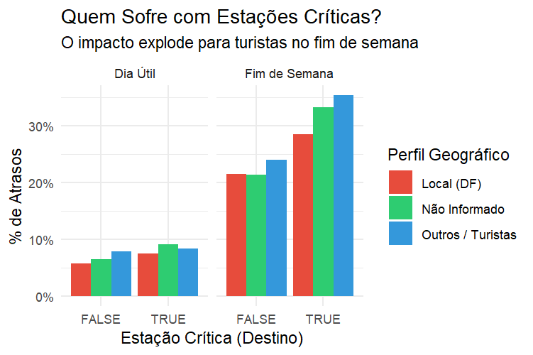
---

---

# 8️⃣ Linha de Base para Modelagem

Após as etapas de limpeza, validação e exploração dos dados, foi possível estabelecer a **linha de base estatística do problema de atraso no sistema +BIKE**.

A análise da variável `ride_late` indica que aproximadamente **9% a 10% das viagens registradas resultam em atraso**.

Esse valor define o **nível estrutural de ocorrência do evento de interesse** dentro da base analisada.

Do ponto de vista estatístico, isso caracteriza um **problema de classificação desbalanceada**, no qual a classe de interesse (viagens com atraso) representa uma parcela relativamente pequena do total de observações.

Essa característica tem implicações diretas na avaliação de modelos preditivos.

Se fosse utilizada apenas a métrica de **acurácia**, um modelo trivial que previsse sempre *“sem atraso”* alcançaria cerca de **90% de acerto**, apesar de não possuir qualquer utilidade prática para identificar situações de risco.

Por esse motivo, a avaliação do modelo deverá priorizar métricas mais adequadas para cenários desbalanceados, como:

- **AUC-ROC**, para avaliar a capacidade discriminativa do modelo;
- **Precision**, para medir a proporção de previsões corretas entre os casos classificados como atraso;
- **Recall**, para avaliar a capacidade do modelo de identificar viagens que efetivamente resultarão em atraso.

Essas métricas permitem avaliar de forma mais robusta a capacidade do modelo em **detectar eventos raros, mas operacionalmente relevantes**.

---

# 9️⃣ Encerramento da EDA e Transição para Modelagem

A Análise Exploratória de Dados permitiu compreender de forma abrangente os padrões de funcionamento do sistema +BIKE e identificar os principais fatores associados à ocorrência de atrasos.

De forma geral, os resultados indicam que o atraso no sistema:

✔ **não é um ruído aleatório** nos dados;

✔ **não decorre predominantemente de comportamento individual do usuário**;

✔ **está fortemente associado ao contexto temporal de uso**, especialmente em finais de semana;

✔ **emerge de desequilíbrios operacionais na rede de estações**, particularmente da saturação de docas durante o processo de devolução.

Essas evidências permitem formalizar o problema de modelagem como a **estimação da probabilidade de atraso antes do início da viagem**.

Matematicamente, o objetivo do modelo pode ser expresso como:

```latex
P(Atraso=1∣X)P(\text{Atraso} = 1 \mid X)
```

em que $X$ representa o conjunto de variáveis observáveis **no momento da retirada da bicicleta**.

Essa restrição é fundamental para garantir a validade operacional do modelo. Variáveis que representam **informações posteriores ao evento**, como a duração final da viagem, não podem ser utilizadas como preditores, pois constituem sintomas do atraso e não suas causas.

Dessa forma, o modelo deve aprender a identificar **padrões estruturais de risco**, baseando-se apenas em informações disponíveis no início da corrida, como:

- contexto temporal da viagem
- características do usuário
- estação de origem
- condições operacionais da rede

O objetivo da modelagem não é penalizar usuários por viagens longas, mas sim **antecipar contextos de risco operacional**, permitindo ações preventivas como:

- redistribuição estratégica de bicicletas;
- monitoramento de estações críticas;
- recomendações de estações alternativas ao usuário.

Por fim, vale ressaltar que o código completo utilizado nesta etapa encontra-se disponível no repositório do projeto:

**EDA Completa:**

[EDA Completa](/analise-R/02-EDA.R)

Esse script contém análises adicionais, visualizações e verificações estatísticas que complementam os resultados apresentados neste documento e contribuem para uma compreensão mais profunda do comportamento do sistema +BIKE.

---
---